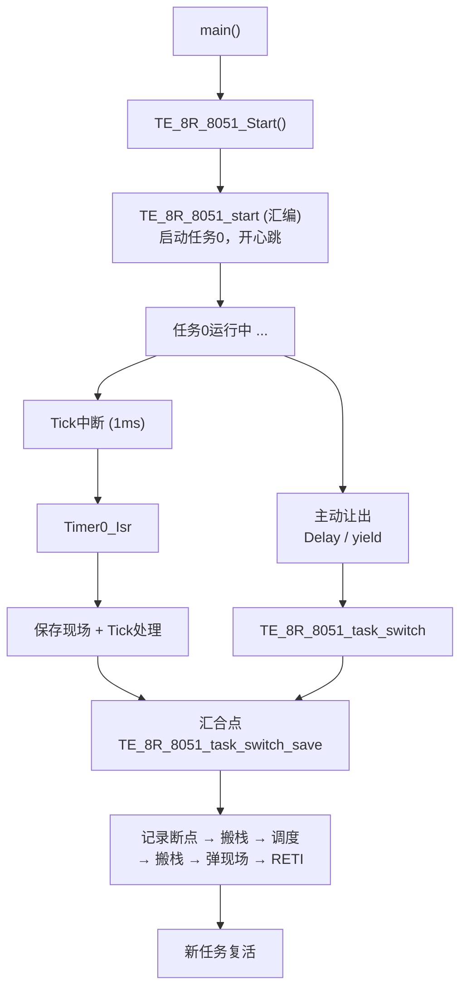
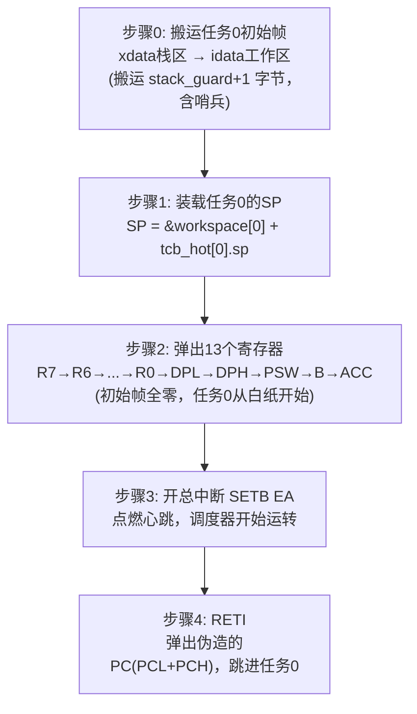
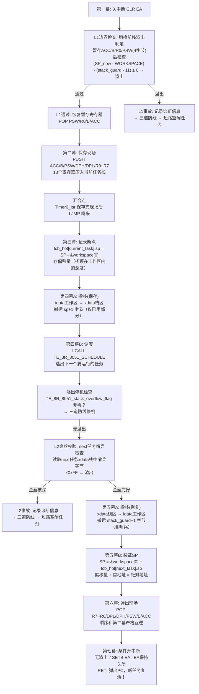
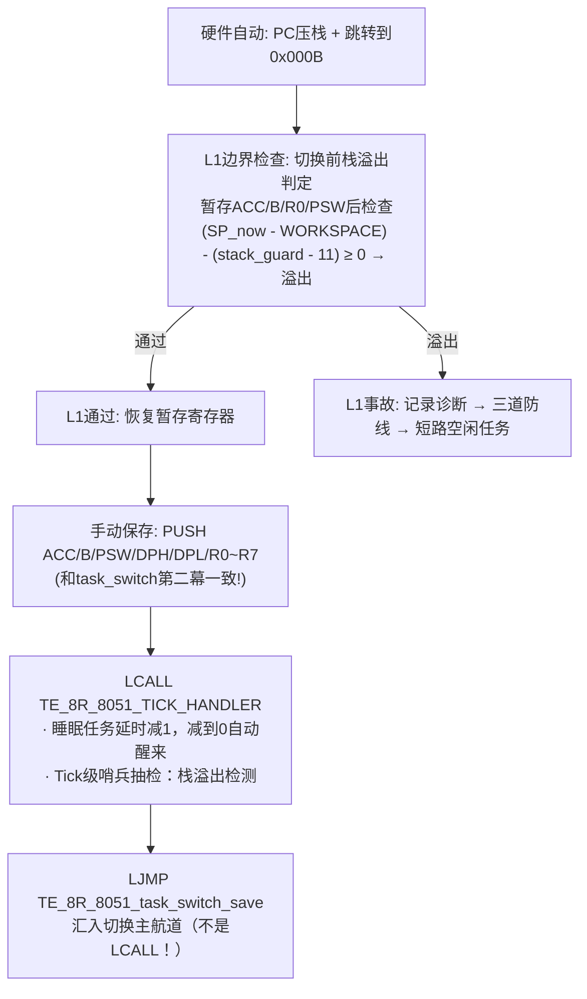
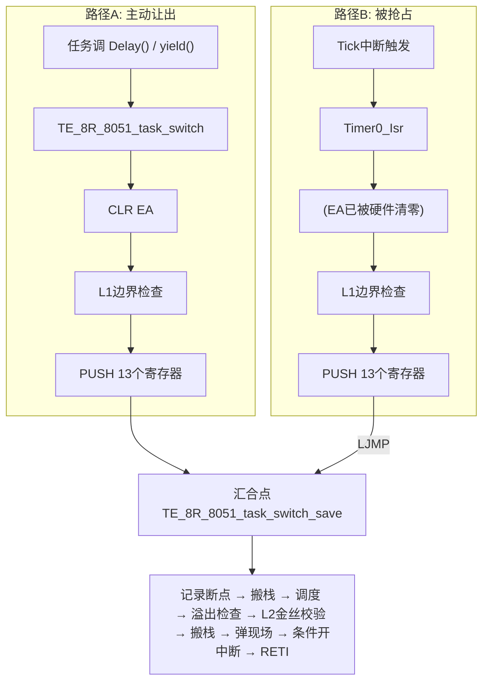
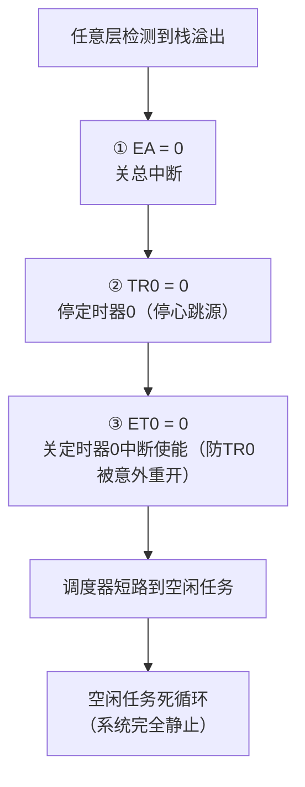
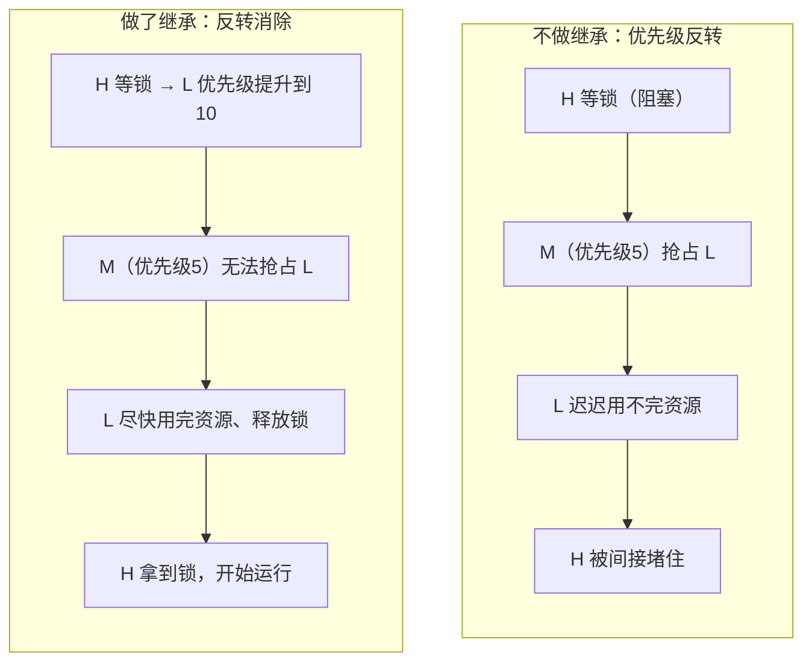
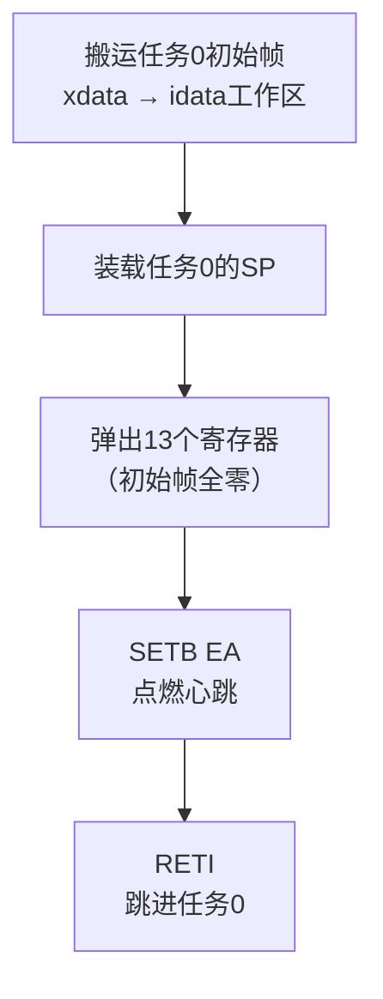

# TE_8R_8051 设计原理说明书

> 本文档专门讲解 TE_8R_8051 内核的运行原理，面向希望深入理解内核机制的读者。

## 目录

**§1~8 汇编核心**

- [§1 Kernel.a51 —— 汇编核心运行原理](#s1)
  - [1.1 三大函数总览](#s1-1)
  - [1.2 TE_8R_8051_start —— 内核点火](#s1-2)
  - [1.3 TE_8R_8051_task_switch —— 任务主动切换](#s1-3)
  - [1.4 Timer0_Isr —— 系统心跳](#s1-4)
  - [1.5 中断向量表登记](#s1-5)
- [§2 汇编与 C 的结构体访问对照](#s2)
  - [2.1 热TCB结构体定义（C侧）](#s2-1)
  - [2.2 访问方式对照表](#s2-2)
  - [2.3 完整映射关系](#s2-3)
  - [2.4 下标为0的特例](#s2-4)
  - [2.5 为什么汇编没有"结构体"概念？](#s2-5)
- [§3 工作区模式与栈搬运](#s3)
  - [3.1 为什么需要工作区模式？](#s3-1)
  - [3.2 两次搬运的方向与数量](#s3-2)
  - [3.3 搬运循环的通用模式](#s3-3)
- [§4 寄存器现场保存与恢复](#s4)
  - [4.1 压栈/弹栈顺序](#s4-1)
  - [4.2 初始帧 vs 运行时帧](#s4-2)
  - [4.3 8051 中断5硬件做了什么？](#s4-3)
- [§5 汇流架构详解](#s5)
  - [5.1 两种切换路径](#s5-1)
  - [5.2 汇流的前提条件](#s5-2)
  - [5.3 汇流的好处](#s5-3)
- [§6 三层栈溢出检测机制](#s6)
  - [6.1 三层防线的互补关系](#s6-1)
  - [6.2 L1 边界*查详解](#s6-2)
  - [6.3 L2 金丝校验详解](#s6-3)
  - [6.4 Tick 级哨兵抽检](#s6-4)
  - [6.5 三道防线停机](#s6-5)
  - [6.6 溢出停机检查（调度后）](#s6-6)
  - [6.7 诊断变量](#s6-7)
  - [6.8 可靠性边界](#s6-8)
- [§7 CLR C 与 SUBB 的配合](#s7)
- [§8 RETI vs RET](#s8)

**§9~15 架构与拆分**

- [§9 配置分离架构](#s9)
  - [9.1 设计动机](#s9-1)
  - [9.2 配置项清单](#s9-2)
  - [9.3 汇编-C常量同步](#s9-3)
- [§10 任务状态谓词宏](#s10)
  - [10.1 设计动机](#s10-1)
  - [10.2 为什么用宏而不是函数？](#s10-2)
  - [10.3 使用示例](#s10-3)
- [§11 汇编-C契约与编译时断言](#s11)
  - [11.1 设计动机](#s11-1)
  - [11.2 契约清单](#s11-2)
  - [11.3 编译时断言实现](#s11-3)
- [§12 Tick处理拆分](#s12)
  - [12.1 设计动机](#s12-1)
  - [12.2 拆分结构](#s12-2)
- [§13 IPC模块拆分](#s13)
  - [13.1 设计动机](#s13-1)
  - [13.2 拆分结果](#s13-2)
- [§14 软件定时器临界区保护](#s14)
  - [14.1 设计动机](#s14-1)
  - [14.2 修复方案](#s14-2)
- [§15 封版修复记录 (F1~F5)](#s15)

**§16~22 机制与原理**

- [§16 8051 存储模型与 RAM 约束](#s16)
- [§17 TCB 冷热分离架构](#s17)
  - [17.1 为什么分两个结构体？](#s17-1)
  - [17.2 为什么不合成一个 TCB？](#s17-2)
  - [17.3 热 TCB 字段清单](#s17-3)
  - [17.4 冷 TCB 字段清单](#s17-4)
  - [17.5 数组布局](#s17-5)
- [§18 meta 位图——一个字节干两件事](#s18)
  - [18.1 契约（谁动哪几位）](#s18-1)
  - [18.2 位图操作宏](#s18-2)
  - [18.3 邮箱容量硬限](#s18-3)
- [§19 临界区保护——三件套](#s19)
  - [19.1 什么是临界区？](#s19-1)
  - [19.2 怎么保护？](#s19-2)
  - [19.3 三件套用法](#s19-3)
  - [19.4 纪律](#s19-4)
- [§20 邮箱机制——最新值有效](#s20)
  - [20.1 邮箱是什么？](#s20-1)
  - [20.2 邮箱不是队列！](#s20-2)
  - [20.3 三个 API 怎么选？](#s20-3)
  - [20.4 为什么信长最后写？](#s20-4)
  - [20.5 墓碑保护](#s20-5)
  - [20.6 阻塞态任务不被邮件唤醒](#s20-6)
  - [20.7 缓冲不足时不消费](#s20-7)
- [§21 互斥量与优先级继承](#s21)
  - [21.1 为什么需要互斥量？](#s21-1)
  - [21.2 等待关系存在哪一边？](#s21-2)
  - [21.3 为什么用位图而不是指针数组？](#s21-3)
  - [21.4 自适应宽度——打破 8 任务硬限](#s21-4)
  - [21.5 自锁检测](#s21-5)
  - [21.6 优先级继承——完整场景](#s21-6)
  - [21.7 为什么继承只看静态优先级？](#s21-7)
  - [21.8 阻塞等待](#s21-8)
  - [21.9 释放时做了什么？](#s21-9)
  - [21.10 为什么转锁后还要做继承？](#s21-10)
  - [21.11 重调度判定](#s21-11)
  - [21.12 try_acquire 适用场景](#s21-12)
  - [21.13 五条纪律](#s21-13)
- [§22 软件定时器——标志位语义](#s22)
  - [22.1 为什么需要软件定时器？](#s22-1)
  - [22.2 标志位语义，不是回调](#s22-2)
  - [22.3 零漂移保证](#s22-3)
  - [22.4 与 Tick 中断的协作](#s22-4)
  - [22.5 开销](#s22-5)

**§23~31 运行机制与约束**

- [§23 调度器运行机制](#s23)
  - [23.1 裁判的判罚规则](#s23-1)
  - [23.2 扫描方式——先++后探测](#s23-2)
  - [23.3 空闲任务识别](#s23-3)
  - [23.4 有效优先级](#s23-4)
  - [23.5 饥饿老化](#s23-5)
  - [23.6 yield 让位机制](#s23-6)
  - [23.7 栈溢出短路](#s23-7)
- [§24 任务创建与初始栈帧](#s24)
  - [24.1 什么是初始栈帧？](#s24-1)
  - [24.2 栈布局（8051 栈向高地址生长）](#s24-2)
  - [24.3 哨兵埋设](#s24-3)
  - [24.4 为什么 task_create_raw 不做参数校验？](#s24-4)
  - [24.5 Task_Create 三层校验](#s24-5)
- [§25 内核初始化与启动时序](#s25)
  - [25.1 Init 做了什么？](#s25-1)
  - [25.2 故意不开 EA](#s25-2)
  - [25.3 Start 启动流程](#s25-3)
- [§26 Tick 处理与延时机制](#s26)
  - [26.1 tick_advance：16 位减法临界区保护](#s26-1)
  - [26.2 tick_guard：为什么只检查当前任务？](#s26-2)
  - [26.3 Delay：为什么写 delay 要关中断？](#s26-3)
  - [26.4 阻塞值和墓碑值不能当延时参数](#s26-4)
  - [26.5 邮箱提前唤醒](#s26-5)
- [§27 空闲任务数据分离](#s27)
- [§28 原子操作与单字节写入](#s28)
- [§29 优先级档位参考](#s29)
- [§30 工作区峰值与 idle 栈预算](#s30)
  - [30.1 workspace_peak](#s30-1)
  - [30.2 idle_stack 36 字节](#s30-2)
- [§31 硬约束与使用纪律](#s31)
  - [31.1 寄存器组](#s31-1)
  - [31.2 栈空间预算](#s31-2)
  - [31.3 idle_task 不能溢出](#s31-3)
  - [31.4 存储模型约定](#s31-4)
  - [31.5 Task_Create 必须在 Start 之前调用](#s31-5)
  - [31.6 ISR 调用限制](#s31-6)

**§32~35 补充**

- [§32 汇编寻址细节](#s32)
  - [32.1 DPTR 装载——没有捷径的 16 位指针](#s32-1)
  - [32.2 CLR C 的坑——8051 没有不带借位的减法](#s32-2)
  - [32.3 中断向量表——LJMP vs AJMP](#s32-3)
  - [32.4 下标为 0 的特例——省掉 MUL](#s32-4)
  - [32.5 汇编没有"结构体"概念](#s32-5)
- [§33 运行时序补充](#s33)
  - [33.1 搬栈保存 vs 搬栈恢复——字节数不同的原因](#s33-1)
  - [33.2 Tick 中断空转——无人睡醒时的代价](#s33-2)
  - [33.3 yield 标记焚毁——为什么必须一次性消费](#s33-3)
  - [33.4 饥饿封顶 250——防止 unsigned char 回绕](#s33-4)
  - [33.5 邮箱快速路径——没信不进临界区](#s33-5)
  - [33.6 定时器到期未读不再减 1——防止重复触发](#s33-6)
  - [33.7 邮箱容量硬限推导](#s33-7)
  - [33.8 1T 模式——STC15 特有的加速](#s33-8)
  - [33.9 初始化故意不开 EA——防止空壳任务被调度](#s33-9)
  - [33.10 阻塞值和墓碑值不能当延时参数](#s33-10)
  - [33.11 邮箱提前唤醒——特性而非缺陷](#s33-11)
- [§34 检测可靠性分级](#s34)
  - [34.1 四级分类](#s34-1)
  - [34.2 为什么灾难级不可靠？](#s34-2)
  - [34.3 诊断变量的读取方法](#s34-3)
  - [34.4 三道防线的作用](#s34-4)

---

<a id="s1"></a>
## 一、Kernel.a51 —— 汇编核心运行原理

<a id="s1-1"></a>
### 1.1 三大函数总览

`Kernel.a51` 是内核的汇编核心，包含三个函数，构成整个调度系统的骨架：

| 函数 | 职责 | 触发时机 | 返回？ |
|------|------|---------|--------|
| `TE_8R_8051_start` | 内核点火，启动任务0 | `main()` 末尾调用 | 永不返回 |
| `TE_8R_8051_task_switch` | 任务主动切换 | `Delay`/`yield`/`mutex_acquire` | `RETI` 到新任务 |
| `Timer0_Isr` | 系统心跳，抢占调度 | 每1ms硬件触发 | 借 `RETI` 收尾 |

三者关系：



---

<a id="s1-2"></a>
### 1.2 TE_8R_8051_start —— 内核点火

#### 流程图



#### 关键原理：为什么要搬初始帧？

`TE_8R_8051_Task_Create()` 在创建任务时，先在 `idata` 工作区里搭好初始帧，再整块搬到 `xdata` 栈区保存。启动时必须搬回来，因为 **8051 的 `SP` 只能指向内部 RAM（`idata`）**，不能指向 `xdata`。栈不在 `idata` 里，弹栈指令无法工作。

搬运算用三条指令的循环完成：

```asm
TE_8R_8051_start_restore_loop:
    MOVX A, @DPTR         ; 从 xdata 读1字节（MOVX访问xdata）
    MOV  @R0, A           ; 写入 idata 工作区
    INC  R0               ; idata 写指针后移
    INC  DPTR             ; xdata 读指针后移
    DJNZ R1, TE_8R_8051_start_restore_loop  ; 计数减1，不为0继续
```

| 角色 | 含义 |
|------|------|
| `DPTR` | `xdata` 侧的"读指针"——从哪读 |
| `R0` | `idata` 侧的"写指针"——写到哪 |
| `R1` | 循环计数——还剩几字节没搬 |

---

<a id="s1-3"></a>
### 1.3 TE_8R_8051_task_switch —— 任务主动切换

#### 七幕剧流程图（含三层栈溢出检测）



#### L1 边界检查原理

L1 在保存现场之前执行，目的是**防止 PUSH 操作本身踩踏哨兵**。如果当前栈已经接近溢出，13 个寄存器的 PUSH 会直接覆盖哨兵，导致后续检测失效。

检查算法：

1. **暂存 4 个寄存器**（ACC/B/R0/PSW）——这些寄存器将被检查算法本身使用，必须先保存
2. **计算**：`(SP_now - WORKSPACE) - (stack_guard - 11)`，其中常数 `11 = 13(寄存器) - 4(暂存净额) + 2(LCALL返回地址)`
3. **判定**：结果 ≥ 0 → 栈空间不足以容纳后续 PUSH，溢出；< 0 → 通过
4. **通过后恢复暂存**：POP PSW/R0/B/ACC，然后正常进入第二幕

常数 11 的含义：从当前 SP 位置到哨兵之间，还需要净压入 11 字节（13 个寄存器 - 4 个已暂存 + 2 字节 LCALL 返回地址已在栈中）。如果当前深度 + 11 已达或超过哨兵，PUSH 必然踩哨兵。

#### L2 金丝校验原理

L2 在调度器选出 next 任务后、搬栈恢复之前执行，目的是**防止派发一个已经溢出的任务**。该任务的哨兵可能在 Tick 抽检间隔内被踩，而调度器并不知道。

检查算法：

1. **读取** next 任务 xdata 栈区中哨兵位置的字节
2. **判定**：≠ 0xFE（`TE_8R_8051_STACK_MAGIC`）→ 哨兵被踩，溢出
3. **通过**：正常进入第五幕搬栈恢复

L2 和 L1 的区别：L1 检查的是**当前任务**（即将被冻结的任务）的栈空间是否够 PUSH；L2 检查的是**下一个任务**（即将被复活的任务）的哨兵是否完好。两者防护方向不同，缺一不可。

#### 关键原理：为什么存偏移量而不是绝对地址？

`tcb_hot[].sp` 存的是 **`idata` 工作区内的栈顶偏移量**，而不是 `SP` 的绝对地址。

**先理解一个事实**：工作区在 `idata` 中的位置在运行时是不会移动的，而任务运行时 `SP` 又只是在工作区中移动——函数调用压栈，`SP` 往高处走；函数返回弹栈，`SP` 往低处退。那么 `SP` 的绝对地址就只是相对于工作区首地址的偏移而已。既然工作区首地址是编译期常量，那存偏移量就等于存了 `SP` 的全部信息，绝对地址随时可以算回来。

当然，直接存 `SP` 的绝对地址也完全可以——复活时直接 `MOV SP, A` 就行，连加法都省了。但存偏移量有额外的好处，见下文三条理由：

1. **共享工作区**：所有任务的栈都在同一块 `idata` 工作区里，绝对地址 = 工作区首地址 + 偏移量。存偏移量就够了，绝对地址可以算出来。

2. **语义清晰**：偏移量就是"栈用了多深"，单字节放得下（`< MAX_WORKSPACE`）。

3. **可直接比较**：偏移量可以直接和 `stack_guard`（也是偏移量）比大小，判断栈是否溢出。如果存绝对地址，比较时还要减去工作区首地址。

**最重要的是**：`tcb_hot[].sp` 和栈里的 `PC` 必须配合好。`PC` 记录"程序执行到哪"，`sp` 记录"栈顶在哪"。复活时，`SP` 装载正确才能从正确位置弹栈，`PC` 才能读出正确的返回地址。缺一不可。

存偏移量和还原 `SP` 是一对逆运算：

```
冻结时:  偏移量 = SP - &workspace[0]     （第三幕，减法）
复活时:  SP = &workspace[0] + 偏移量     （第五幕B，加法）
```

---

<a id="s1-4"></a>
### 1.4 Timer0_Isr —— 系统心跳

#### 流程图（含 L1 边界检查）



#### L1 在 ISR 中的必要性

Timer0_Isr 中的 L1 检查与 `TE_8R_8051_task_switch` 中的完全相同，使用同一常数 11。ISR 入口处硬件已压入 PC（2 字节），此时 SP 已比任务正常运行时高了 2 字节。如果栈已经接近溢出，13 个寄存器的 PUSH 会踩踏哨兵。L1 在 PUSH 之前拦截，确保保存现场操作本身不会破坏哨兵完整性。

#### 关键原理：为什么 ISR 里要手动保存寄存器？

8051 硬件响应中断时，**只自动保存了 `PC`**（压栈2字节后跳转），其余寄存器（`ACC`, `B`, `PSW`, `DPTR`, `R0`~`R7`）全部留在原处不动。但 ISR 里会调用 `TE_8R_8051_Tick_Handler` 等 C 函数，这些函数不可避免地会使用 `ACC`、`R0`~`R7` 等寄存器——C 编译器把它们当通用寄存器用，函数执行时必然覆盖其中的值。

如果不手动保存，中断返回后被打断任务看到的寄存器已经被 ISR 悄悄改了——轻则数据错乱，重则程序跑飞。所以必须在 ISR 入口处手动 `PUSH` 全部13个寄存器，出口处 `POP` 还原。

但我们的 ISR 更特殊：它不是"处理完就返回"，而是 `LJMP` 跳到切换主航道，把当前任务彻底冻结、换下一个任务上来。这意味着 `POP` 还原不会在 ISR 里发生，而是等到这个任务将来被调度器重新选中时，在第六幕统一弹出。所以这13个 `PUSH` 保存的不仅是"ISR 别碰我的寄存器"，更是"当前任务的完整现场"——冻结快照。

#### 关键原理：为什么 ISR 没有自己的 RETI？

`Timer0_Isr` 通过 `LJMP` 跳到 `TE_8R_8051_task_switch_save`，借用那边的 `RETI` 收尾。这是精心设计的**汇流架构**：

- 两种切换路径（主动让出 / 被抢占）的后续操作完全一样
- 共用一套代码省 ROM，且行为一致
- 任务视角里，"我调了 `Delay()`" 和 "我被 Tick 抢了" 没有任何区别

**汇流的前提**：`Timer0_Isr` 保存现场的方式必须和 `TE_8R_8051_task_switch` 第二幕完全一致——同样的寄存器、同样的压栈顺序。否则汇合点后的代码无法正确处理两种来源的栈帧。

#### 关键原理：为什么用 LJMP 而不是 LCALL？

`LJMP` 是"跳过去继续执行"，`LCALL` 是"调用后返回"。如果用 `LCALL`，返回地址会被压栈，污染栈帧——汇合点后的代码会误以为这个返回地址是任务现场的一部分，弹栈时弹错位置。

---

<a id="s1-5"></a>
### 1.5 中断向量表登记

```asm
CSEG AT 0000BH
LJMP Timer0_Isr
```

8051 硬件规定：定时器0溢出时，CPU 自动跳转到 `0x000B`。这两行就是在 `0x000B` 处放一条跳板，引导到真正的 ISR。

**为什么这个汇编文件里要手写？** 因为 `Timer0_Isr` 是在汇编中实现的（要精确控制压栈顺序和汇入切换主航道），C 编译器不会替汇编函数登记向量表。如果 ISR 写在 C 文件里（用 `interrupt` 关键字），编译器会自动放跳板，不用手写。

---

<a id="s2"></a>
## 二、汇编与 C 的结构体访问对照

这是理解 `Kernel.a51` 的核心知识点。TCB 冷热分离后，任务数据从分散数组变成了结构体数组，汇编必须手工计算地址才能访问字段。

<a id="s2-1"></a>
### 2.1 热TCB结构体定义（C侧）

```c
typedef struct {
    unsigned char sp;           // 偏移 0
    unsigned char meta;         // 偏移 1
    unsigned char xstack_dpl;   // 偏移 2
    unsigned char xstack_dph;   // 偏移 3
    unsigned char stack_guard;  // 偏移 4
} TE_8R_8051_tcb_hot_t;              // 总大小 = 5 字节

TE_8R_8051_tcb_hot_t data tcb_hot[TE_8R_8051_SLOT_COUNT];
```

<a id="s2-2"></a>
### 2.2 访问方式对照表

以 `tcb_hot[current_task].sp` 为例，完整走一遍五步寻址：

| 步骤 | 做了什么 | C 语言 | 8051 汇编 |
|------|---------|--------|----------|
| ① 拿数组首地址 | 找到 `tcb_hot[0]` 在内存中的位置——这是整个数组的起点，后续所有偏移都从这里出发 | 编译器自动 | `MOV A, #TCB_HOT` |
| ② 算下标偏移 | 算出第 `i` 个元素相对于数组开头的距离——每个结构体占5字节，第 `i` 个就在 `i×5` 处 | 编译器自动算 `i × sizeof` | `MOV A, CURRENT_TASK` → `MOV B, #05H` → `MUL AB` |
| ③ 首地址 + 下标偏移 | 定位到第 `i` 个结构体的起始位置——现在知道了 `tcb_hot[i]` 在哪里 | 编译器自动 | `ADD A, #TCB_HOT` |
| ④ 加字段偏移 | 从结构体起始位置再往后挪几步，找到目标字段——`sp` 在偏移0处，`xstack_dpl` 在偏移2处，`stack_guard` 在偏移4处 | 编译器自动 | `ADD A, #00H`（`sp` 偏移0，可省略） |
| ⑤ 读写字段 | 通过计算出的地址，读出或写入目标字段的值 | `tcb_hot[i].sp = value;` | `MOV R0, A` → `MOV @R0, value` |

用图来表示内存布局（从低地址到高地址，逐行排列）：

```
        tcb_hot[0]              tcb_hot[1]              tcb_hot[2]
     首地址=TCB_HOT         首地址=TCB_HOT+5        首地址=TCB_HOT+10
    ┌─────────────────┐   ┌─────────────────┐   ┌─────────────────┐
    │ +0  .sp         │   │ +0  .sp         │   │ +0  .sp         │
    │ +1  .meta       │   │ +1  .meta       │   │ +1  .meta       │
    │ +2  .xstack_dpl │   │ +2  .xstack_dpl │   │ +2  .xstack_dpl │
    │ +3  .xstack_dph │   │ +3  .xstack_dph │   │ +3  .xstack_dph │
    │ +4  .stack_guard│   │ +4  .stack_guard│   │ +4  .stack_guard│
    └─────────────────┘   └─────────────────┘   └─────────────────┘
```

以访问 `tcb_hot[1].stack_guard` 为例，走一遍五步寻址：


**C 语言一行搞定的事，汇编要五步。** 编译器替你做了①②③④，汇编里必须自己算。

<a id="s2-3"></a>
### 2.3 完整映射关系

| C 表达式 | 汇编寻址公式 | 汇编代码 |
|----------|------------|---------|
| `tcb_hot[i].sp` | `TCB_HOT + i×5 + 0` | `MUL AB` → `ADD A,#TCB_HOT` → `MOV R0,A` → `MOV A,@R0` |
| `tcb_hot[i].meta` | `TCB_HOT + i×5 + 1` | 同上，再 `INC R0` |
| `tcb_hot[i].xstack_dpl` | `TCB_HOT + i×5 + 2` | `MUL AB` → `ADD A,#TCB_HOT` → `ADD A,#02H` → `MOV R0,A` → `MOV DPL,@R0` |
| `tcb_hot[i].xstack_dph` | `TCB_HOT + i×5 + 3` | 同上，再 `INC R0` → `MOV DPH,@R0` |
| `tcb_hot[i].stack_guard` | `TCB_HOT + i×5 + 4` | `MUL AB` → `ADD A,#TCB_HOT` → `ADD A,#04H` → `MOV R0,A` → `MOV A,@R0` |

<a id="s2-4"></a>
### 2.4 下标为0的特例

当访问 `tcb_hot[0]` 时（`TE_8R_8051_start` 中启动任务0），下标为0，`0 × 5 = 0`，不需要 `MUL` 指令，直接从 `#TCB_HOT` 开始加字段偏移即可。

```
C:  tcb_hot[0].stack_guard
汇编: #TCB_HOT + 4  (省掉了 MUL AB)
```

<a id="s2-5"></a>
### 2.5 为什么汇编没有"结构体"概念？

C 编译器知道结构体的布局（哪个字段在哪个偏移），因为编译器就是定义结构体的那方。但汇编器只认字节和地址——它不知道 `tcb_hot` 是结构体数组，只知道 `TCB_HOT` 是一个符号（首地址）。所以汇编必须：

1. **自己算偏移**：`i × sizeof + field_offset`
2. **自己维护一致性**：C 侧改了结构体，汇编侧的 `#05H`、`#02H`、`#04H` 必须同步改

这是 8051 的物理限制，不是设计缺陷。汇编无法 `#include` C 头文件，无法使用 `sizeof`。

---

<a id="s3"></a>
## 三、工作区模式与栈搬运

<a id="s3-1"></a>
### 3.1 为什么需要工作区模式？

8051 的 `idata` 只有 128~256 字节。如果每个任务都在 `idata` 里独占一块栈区，4 个任务各要 20 字节，加上系统开销，`idata` 就放不下了。

工作区模式的解法：`idata` 里只留**一块共享栈区**（工作区），同一时刻只有一个任务占用。任务冻结时栈内容搬到 `xdata` 保存，复活时搬回来。


<a id="s3-2"></a>
### 3.2 两次搬运的方向与数量

| 时机 | 方向 | 搬运数量 | 为什么 |
|------|------|---------|--------|
| 保存（第四幕A） | `idata` → `xdata` | `sp + 1` 字节 | 只搬已用部分，省时间 |
| 恢复（第五幕A） | `xdata` → `idata` | `stack_guard + 1` 字节 | 含哨兵，Tick 才能检查 |

为什么恢复时多搬？因为保存时只搬了已用部分，哨兵还在 `xdata` 栈区里没动过。恢复时必须把整个栈区（含哨兵）都搬回 `idata`，Tick 中断才能检查哨兵是否被踩。

<a id="s3-3"></a>
### 3.3 搬运循环的通用模式

无论哪个方向，搬运都是同一个模式：

```asm
    MOV R1, #count        ; R1 = 要搬多少字节
    ; R0 = idata侧指针
    ; DPTR = xdata侧指针
loop:
    MOVX A, @DPTR        ; 从xdata读（或 MOV A,@R0 从idata读）
    MOV  @R0, A          ; 写入idata（或 MOVX @DPTR,A 写入xdata）
    INC  R0              ; idata指针后移
    INC  DPTR            ; xdata指针后移
    DJNZ R1, loop        ; 计数减1，不为0继续
```

---

<a id="s4"></a>
## 四、寄存器现场保存与恢复

<a id="s4-1"></a>
### 4.1 压栈/弹栈顺序

8051 栈向高地址生长（`PUSH`: `SP+1` 再写入）。压栈和弹栈顺序必须严格互逆：

```
压栈（第二幕）：              弹栈（第六幕）：
  PUSH ACC   ← 最先压        POP ACC    ← 最后弹
  PUSH B                      POP B
  PUSH PSW                    POP PSW
  PUSH DPH                    POP DPH
  PUSH DPL                    POP DPL
  PUSH R0                     POP R0
  PUSH R1                     POP R1
  ...                         ...
  PUSH R7   ← 最后压          POP R7    ← 最先弹
```

栈中的布局（低地址在上）：

```
workspace[0]   → PCL  ← RETI弹出，送入PC
workspace[1]   → PCH
workspace[2]   → ACC
workspace[3]   → B
workspace[4]   → PSW
workspace[5]   → DPH
workspace[6]   → DPL
workspace[7]   → R0
workspace[8]   → R1
  ...
workspace[14]  → R7  ← SP指向此处
```

<a id="s4-2"></a>
### 4.2 初始帧 vs 运行时帧

| | 初始帧（`Task_Create` 搭建） | 运行时帧（切换时保存） |
|--|-------------------------|---------------------|
| `PCL`/`PCH` | 任务函数入口地址 | 断点地址（被中断/让出的位置） |
| 其余寄存器 | 全零 | 当时的真实值 |
| 用途 | 第一次启动时"伪造现场" | 冻结后将来复活 |

<a id="s4-3"></a>
### 4.3 8051 中断硬件做了什么？

硬件响应中断时，**只自动做两件事**：

1. 把当前 `PC` 压栈保存（2字节）
2. 跳转到中断向量（`0x000B`）

其余寄存器（`ACC`, `B`, `PSW`, `DPTR`, `R0`~`R7`）**全部留在原处不动**。所以必须手动压栈保存，否则 ISR 和后续调度的 C 函数会覆盖这些寄存器，任务恢复时面目全非。

---

<a id="s5"></a>
## 五、汇流架构详解

<a id="s5-1"></a>
### 5.1 两种切换路径



<a id="s5-2"></a>
### 5.2 汇流的前提条件

1. **压栈顺序一致**：两条路径压的寄存器种类和顺序完全相同
2. **`PC` 已在栈中**：路径A 由 `LCALL` 压入 `PC`，路径B 由硬件自动压入 `PC`——汇合点后统一处理
3. **`LJMP` 而非 `LCALL`**：ISR 跳到汇合点用 `LJMP`，不会额外压栈污染帧

<a id="s5-3"></a>
### 5.3 汇流的好处

- **省 ROM**：后续逻辑只写一份
- **行为一致**：任务无法区分"我主动睡了"和"我被抢了"
- **维护简单**：改切换逻辑只改一处

---

<a id="s6"></a>
## 六、三层栈溢出检测机制

8051 没有 MMU，无法硬件检测栈溢出。TE_8R_8051 用三层防线弥补这一物理极限：

```mermaid
flowchart TD
    subgraph L1["L1: 切换入口边界检查"]
        L1A["时机: task_switch / Timer0_Isr 入口<br/>PUSH 13寄存器之前"]
        L1B["检查: (SP_now - WORKSPACE) - (stack_guard - 11) ≥ 0"]
        L1C["防护: PUSH 本身不会踩哨兵"]
        L1A --> L1B --> L1C
    end

    subgraph L2["L2: 调度后金丝校验"]
        L2A["时机: 调度器选出 next 任务后<br/>搬栈恢复之前"]
        L2B["检查: next任务xdata栈中哨兵 ≠ 0xFE"]
        L2C["防护: 不派发已溢出的任务"]
        L2A --> L2B --> L2C
    end

    subgraph Tick["Tick: 周期哨兵抽检"]
        TA["时机: 每1ms Tick中断中<br/>Tick_Handler 执行时"]
        TB["检查: workspace[stack_guard] ≠ 0xFE"]
        TC["防护: 检测运行中栈增长踩哨兵"]
        TA --> TB --> TC
    end
```



<a id="s6-1"></a>
### 6.1 三层防线的互补关系

| 层级 | 检测对象 | 防护方向 | 漏检场景 | 被谁补位 |
|------|---------|---------|---------|---------|
| L1 | 当前任务 | PUSH 不会踩哨兵 | 任务运行中缓慢增长，未触发切换 | Tick |
| L2 | next 任务 | 不派发已溢出任务 | 当前任务刚溢出，尚未切换 | L1 + Tick |
| Tick | 当前任务 | 运行中栈增长踩哨兵 | 两次 Tick 之间溢出又恢复（极罕见） | L1（下次切换时捕获） |

**三层缺一不可**：
- 去掉 L1：PUSH 可能直接覆盖哨兵，后续所有检测失效
- 去掉 L2：可能派发一个哨兵已被踩的任务，该任务运行时数据已损坏
- 去掉 Tick：任务运行中栈缓慢增长踩哨兵，直到下次切换才能检测，窗口期长

<a id="s6-2"></a>
### 6.2 L1 边界检查详解

L1 在 `TE_8R_8051_task_switch` 和 `Timer0_Isr` 的入口处执行，**两条切换路径共用同一套 L1 代码**。

检查前必须暂存 4 个寄存器（ACC/B/R0/PSW），因为检查算法本身需要使用它们：

```asm
    PUSH ACC                ; 暂存
    PUSH B
    PUSH 0x00               ; 暂存R0
    PUSH PSW
    ; --- L1 检查 ---
    MOV  A, SP
    CLR  C
    SUBB A, #TE_8R_8051_WORKSPACE    ; A = SP_now - WORKSPACE (当前栈深度)
    MOV  R0, A
    ; 计算 tcb_hot[current_task].stack_guard
    ...
    CLR  C
    SUBB A, #0BH            ; A = stack_guard - 11
    CLR  C
    MOV  A, R0
    SUBB A, ...              ; (SP_now - WORKSPACE) - (stack_guard - 11)
    JNC  l1_overflow         ; ≥ 0 → 溢出
```

常数 `11 = 13(寄存器) - 4(暂存净额) + 2(LCALL返回地址)`，与 `TE_8R_8051_ISR_FRAME_SIZE(17)` 的关系：`11 = ISR_FRAME_SIZE - 4 - 2`（减去暂存净额和额外安全裕量）。

**L1 通过后**：POP 恢复暂存的 4 个寄存器，然后正常进入第二幕 PUSH 13 个寄存器。

**L1 溢出时**：记录诊断信息，执行三道防线停机，短路到空闲任务。

<a id="s6-3"></a>
### 6.3 L2 金丝校验详解

L2 在调度器返回后、搬栈恢复前执行：

```asm
    ; --- L2: 读取 next 任务 xdata 栈中哨兵 ---
    ; DPTR 指向 next 任务栈区中哨兵位置
    MOVX A, @DPTR
    CJNE A, #0FEH, l2_overflow    ; ≠ 0xFE → 哨兵被踩
```

L2 的关键价值：调度器只看优先级和就绪态，**不知道任务的栈是否健康**。如果一个任务的栈在 Tick 抽检间隔内溢出（例如两次 Tick 之间发生了深度递归），调度器仍可能选中它。L2 在派发前最后一刻拦截，防止 CPU 跳进一个栈已损坏的任务。

<a id="s6-4"></a>
### 6.4 Tick 级哨兵抽检

在 `TE_8R_8051_Tick_Handler` 中，每个 Tick 检查当前运行任务的哨兵：

```c
if (current_task < TE_8R_8051_MAX_TASKS)
{
    if (TE_8R_8051_workspace[tcb_hot[current_task].stack_guard] != TE_8R_8051_STACK_MAGIC)
    {
        TE_8R_8051_stack_overflow_flag  = 0xFF;
        TE_8R_8051_stack_overflow_id    = current_task;
        TE_8R_8051_stack_overflow_sp    = SP;
        TE_8R_8051_stack_overflow_task_sp = tcb_hot[current_task].sp;
        TE_8R_8051_stack_overflow_guard_offset = tcb_hot[current_task].stack_guard;
        TE_8R_8051_stack_overflow_magnitude = tcb_hot[current_task].sp - tcb_hot[current_task].stack_guard;
    }
}
```

Tick 检测的是**运行中的任务**——任务函数调用导致栈向高地址增长，踩到哨兵时触发。

<a id="s6-5"></a>
### 6.5 三道防线停机

任何一层检测到溢出后，系统分三步停机：



<a id="s6-6"></a>
### 6.6 溢出停机检查（调度后）

调度器返回后、恢复新任务现场前，还有一道检查：

```asm
    JB TE_8R_8051_STACK_OVERFLOW_FLAG, overflow_shutdown
    SJMP switch_restore

overflow_shutdown:
    CLR TR0
    CLR ET0
    CLR EA
```

如果溢出了，不开中断直接 `RETI` 到空闲任务；如果没溢出，正常开中断 `RETI` 到新任务。

<a id="s6-7"></a>
### 6.7 诊断变量

溢出停机后，通过调试器读取 6 个诊断变量：

| 变量 | 类型 | 含义 |
|------|------|------|
| `TE_8R_8051_stack_overflow_flag` | unsigned char data | 非零表示溢出发生 |
| `TE_8R_8051_stack_overflow_id` | unsigned char data | 哪个任务溢出 |
| `TE_8R_8051_stack_overflow_sp` | unsigned char data | 检测时刻 SP 寄存器绝对值 |
| `TE_8R_8051_stack_overflow_task_sp` | unsigned char data | 溢出任务冻结时栈顶偏移量 |
| `TE_8R_8051_stack_overflow_guard_offset` | unsigned char data | 溢出任务哨兵在工作区中的偏移量 |
| `TE_8R_8051_stack_overflow_magnitude` | unsigned char data | 溢出幅度 = task_sp - stack_guard |

推算：哨兵与栈顶间距 = `stack_guard - task_sp`，间距越小，溢出时栈距天花板越近。

<a id="s6-8"></a>
### 6.8 可靠性边界

| 溢出程度 | L1 | L2 | Tick | 诊断值正确性 | 停机 |
|----------|----|----|------|-------------|------|
| 轻度/中度 (踩哨兵或部分用户变量) | ✅ | ✅ | ✅ | ✅ 正确 | ✅ 成功 |
| 重度 (踩 tcb_hot[].sp 等内核数据) | ✅ | ✅ | ✅ | ⚠️ sp 值可能错 | ✅ 成功 |
| 灾难级 (踩 idle_task 栈或调度器核心) | ❌ | ❌ | ❌ | — | — |

第三行是 8051 无 MMU 的物理极限，任何纯软件方案都无法突破。

---

<a id="s7"></a>
## 七、CLR C 与 SUBB 的配合

8051 的 `SUBB` 是**带借位减法**：`A = A - 源 - CY`。`CY` 是进位/借位标志，会被前一条指令残留。

```asm
    CLR C                 ; 必须先清CY！
    SUBB A, #TE_8R_8051_WORKSPACE
```

如果不清 `CY`，前一条指令残留的 `CY=1` 会让结果**多减1**。这是 8051 汇编的经典坑——8051 没有不带借位的减法指令（没有 `SUB`），只有 `SUBB`，所以每次减法前必须 `CLR C`。

---

<a id="s8"></a>
## 八、RETI vs RET

| | `RET` | `RETI` |
|--|-----|------|
| 弹出 `PC` | ✅ | ✅ |
| 清除中断优先级状态 | ❌ | ✅ |

TE_8R_8051 用 `RETI` 而非 `RET`，因为 `PC` 是中断入口时硬件自动压入的，必须用 `RETI` 配对弹出。否则中断系统认为"这个中断还没处理完"，同级和低级中断会被永久屏蔽。

`TE_8R_8051_start` 中也用 `RETI`，虽然不是真正从中断返回，但初始帧里的 `PC` 是伪造的，`RETI` 只是借它的弹出机制跳转，同时清除可能残留的中断优先级状态。

---

<a id="s9"></a>
## 九、配置分离架构

<a id="s9-1"></a>
### 9.1 设计动机

初学者面对内核代码时，最困惑的问题之一是"我要改哪个参数？"。如果配置宏散落在多个文件里，改错地方的风险很高——比如误改了内核逻辑中的常量，或者漏改了汇编侧的对应值。

配置分离把"用户要改的东西"和"内核实现细节"严格分开：

```
TE_8R_8051_config.h     ← 用户唯一需要关注的配置文件
TE_8R_8051.h            ← 公开API（#include config.h，用户不直接改这里）
TE_8R_8051_internal.h   ← 内部实现细节（用户不看）
TE_8R_8051_config.inc   ← 汇编侧常量（与config.h手动同步）
```

<a id="s9-2"></a>
### 9.2 配置项清单

| 宏 | 含义 | 默认值 | 约束 |
|----|------|--------|------|
| `FOSC` | 单片机主频 | 24000000UL | — |
| `TICK_MS` | 每Tick毫秒数 | 1 | — |
| `TE_8R_8051_MAX_TASKS` | 最大用户任务数 | 4 | ≥ 1 且 ≤ 25（data区容量限制） |
| `TE_8R_8051_MAILBOX_CAPACITY` | 邮箱容量(字节) | 4 | 1 ~ 15 |
| `TE_8R_8051_AGING_STEP` | 饥饿老化步长 | 32 | ≠ 0（调度器除零防护） |
| `TE_8R_8051_MAX_WORKSPACE` | idata工作区大小 | 64 | ≥ 最大任务栈 |
| `TE_8R_8051_STACK_MAGIC` | 栈哨兵魔数 | 0xFE | — |
| `FOSC × TICK_MS / 1000` | 定时器0计数值 | 24000 | ≤ 65535（16位定时器范围） |

<a id="s9-3"></a>
### 9.3 汇编-C常量同步

8051的汇编和C是两个独立的世界，各自有常量定义。如果汇编里的 `STACK_MAGIC` 和C里的不一致，哨兵检测就失效——但这种不一致编译器不会报错，只有运行时才暴露。

解决方案：

1. **C侧**：常量定义在 `TE_8R_8051_config.h`，汇编侧定义在 `TE_8R_8051_config.inc`
2. **汇编侧**：`Kernel_8051.a51` 通过 `$INCLUDE (TE_8R_8051_CONFIG.INC)` 引入
3. **编译时断言兜底**：C侧用负数数组大小技巧，在编译期检测关键布局假设

修改纪律：改 `TE_8R_8051_config.h` 中的值时，**必须同步修改** `TE_8R_8051_config.inc`！

---

<a id="s10"></a>
## 十、任务状态谓词宏

<a id="s10-1"></a>
### 10.1 设计动机

`tcb_cold[i].delay` 的值域编码了任务的完整状态：

| delay 值 | 状态 |
|----------|------|
| 0xFFFF | 墓碑（槽位未使用） |
| 0xFFFE | 阻塞态（等互斥量） |
| 0 | 就绪态（随时可以上CPU） |
| 1 ~ 65533 | 睡眠态（每Tick减1，减到0自动醒来） |

以前代码里散落着 `tcb_cold[i].delay != 0`、`tcb_cold[i].delay == 0xFFFF` 这样的魔数判断，读代码的人得在脑子里翻译"0xFFFF是什么意思来着"。

谓词宏让状态判断一目了然：

```c
#define TE_8R_8051_IS_TOMBSTONE(i)  (tcb_cold[i].delay == 0xFFFF)
#define TE_8R_8051_IS_BLOCKED(i)    (tcb_cold[i].delay == TE_8R_8051_TASK_BLOCKED)
#define TE_8R_8051_IS_READY(i)      (tcb_cold[i].delay == 0)
#define TE_8R_8051_IS_SLEEPING(i)   (tcb_cold[i].delay > 0 && tcb_cold[i].delay < TE_8R_8051_TASK_BLOCKED)
```

**注意**：`IS_SLEEPING` 宏两次读取 `tcb_cold[i].delay`（16位变量）。若两次读取之间被中断打断且ISR修改了 `delay`，两次读取的值可能不一致（撕裂读取）。因此本宏**必须在 EA=0 环境下使用**（ISR上下文或临界区内）。当前所有调用点（调度器、tick_advance）均在关中断环境下，安全。

<a id="s10-2"></a>
### 10.2 为什么用宏而不是函数？

8051上函数调用的开销不小（`LCALL+RET` 至少4字节ROM+2字节栈），而且这些谓词在调度器和Tick中断的热路径里使用。宏展开后就是一条比较指令，零额外开销。

<a id="s10-3"></a>
### 10.3 使用示例

调度器中的候选资格判断：

```c
// 旧写法（魔数，读代码需要心算翻译）
if (tcb_cold[next_task].delay != 0) continue;

// 新写法（谓词宏，一眼就知道在排除什么状态）
if (TE_8R_8051_IS_TOMBSTONE(next_task)) continue;
if (TE_8R_8051_IS_BLOCKED(next_task))   continue;
if (TE_8R_8051_IS_SLEEPING(next_task))  continue;
```

---

<a id="s11"></a>
## 十一、汇编-C契约与编译时断言

<a id="s11-1"></a>
### 11.1 设计动机

8051的汇编和C没有类型系统把它们连起来。如果汇编里 `sizeof(tcb_hot[0])` 假设是5，但C里改成了6——编译不会报错，运行时汇编按5算偏移，访问到错误字段，程序跑飞。

<a id="s11-2"></a>
### 11.2 契约清单

| 契约 | 含义 | 违反后果 |
|------|------|---------|
| `sizeof(TE_8R_8051_tcb_hot_t) == 5` | 汇编用 `MUL AB(#05H)` 算TCB偏移 | 结构体大小变了偏移就全错 |
| `TE_8R_8051_ISR_FRAME_SIZE == 17` | 汇编L1检测用 `#0BH(=17-4)` 做边界计算 | 帧大小变了检测就失效 |

<a id="s11-3"></a>
### 11.3 编译时断言实现

Keil C51不支持 `_Static_assert`，但有一个经典技巧：

```c
extern unsigned char code _assert_tcb_hot_size[sizeof(TE_8R_8051_tcb_hot_t) == 5 ? 1 : -1];
extern unsigned char code _assert_isr_frame[TE_8R_8051_ISR_FRAME_SIZE == 17 ? 1 : -1];
```

如果条件不满足，数组大小为-1——负数不能做数组大小，编译报错。如果条件满足，数组大小为1——code区占1字节，开销可忽略。

---

<a id="s12"></a>
## 十二、Tick处理拆分

<a id="s12-1"></a>
### 12.1 设计动机

原来的 `TE_8R_8051_Tick_Handler` 把"推进时间"和"哨兵抽检"两件逻辑上独立的事混在一个函数里，初学者读代码时不容易区分"哪些代码在管时间，哪些代码在管栈安全"。

<a id="s12-2"></a>
### 12.2 拆分结构

```c
static void TE_8R_8051_tick_advance(void)   // 时间推进：睡眠任务延时减1
{
    for (i = 0; i < TE_8R_8051_MAX_TASKS; i++) {
        if (TE_8R_8051_IS_SLEEPING(i)) {
            tcb_cold[i].delay--;
        }
    }
}

static void TE_8R_8051_tick_guard(void)     // 哨兵抽检：检查当前任务栈溢出
{
    if (current_task >= TE_8R_8051_MAX_TASKS) return;
    if (TE_8R_8051_workspace[tcb_hot[current_task].stack_guard] != TE_8R_8051_STACK_MAGIC) {
        // 停机 ...
    }
}

void TE_8R_8051_Tick_Handler(void)          // 心跳入口（汇编LCALL的目标）
{
    TE_8R_8051_tick_advance();
    TE_8R_8051_tick_guard();
}
```

外部接口名 `TE_8R_8051_Tick_Handler` 不变，汇编不需要任何修改——零侵入。

---

<a id="s13"></a>
## 十三、IPC模块拆分

<a id="s13-1"></a>
### 13.1 设计动机

原来的 `TE_8R_8051_ipc.c` 把邮箱和互斥量两种完全不同的IPC机制放在同一个文件里。初学者想了解邮箱时，不得不翻过互斥量的代码；想了解互斥量时，又被邮箱的代码干扰。

<a id="s13-2"></a>
### 13.2 拆分结果

| 文件 | 内容 | 行数特征 |
|------|------|---------|
| `TE_8R_8051_mailbox.c` | 邮箱三个API：Send/Post/Read | ~100行，专注邮箱语义 |
| `TE_8R_8051_mutex.c` | 互斥量四个API：init/acquire/release/try_acquire | ~200行，专注互斥量语义 |

拆分后，初学者可以单独阅读邮箱机制或互斥量机制，不必同时面对两种IPC。每个文件的开头都有完整的设计原理注释，自成一体。

---

<a id="s14"></a>
## 十四、软件定时器临界区保护

<a id="s14-1"></a>
### 14.1 设计动机

`TE_8R_8051_timer_expired()` 的 `flags &= ~EXPIRED` 操作展开为3条指令（读→AND→写），是典型的读-改-写序列。若 Tick ISR 在读和写之间修改了 `flags`（例如单次定时器到期时清 `ENABLED` 位），ISR 的修改会被任务的写操作覆盖，导致 `ENABLED` 位被错误恢复——单次定时器到期后看似仍在运行。

<a id="s14-2"></a>
### 14.2 修复方案

在 `timer_expired` 中用临界区三件套包裹读-改-写操作：

```c
unsigned char TE_8R_8051_timer_expired(unsigned char id)
{
    TE_8R_8051_CRITICAL_VAR();
    if (id >= TE_8R_8051_MAX_TIMERS) return 0;
    TE_8R_8051_ENTER_CRITICAL();
    if (TE_8R_8051_timers[id].flags & TE_8R_8051_TIMER_EXPIRED) {
        TE_8R_8051_timers[id].flags &= ~TE_8R_8051_TIMER_EXPIRED;
        TE_8R_8051_EXIT_CRITICAL();
        return 1;
    }
    TE_8R_8051_EXIT_CRITICAL();
    return 0;
}
```

开销：每次查询增加2条MOV指令（保存/恢复EA），约2机器周期，可忽略。

---

<a id="s15"></a>
## 十五、封版修复记录 (F1~F5)

| 编号 | 发现项 | 修改文件 | 修改内容 |
|------|--------|---------|---------|
| F1 | TIMER0_RELOAD溢出无编译期防护 | TE_8R_8051_config.h | 新增 `#if (FOSC * TICK_MS / 1000) > 65535` → `#error` |
| F2 | timer_expired读-改-写竞态 | TE_8R_8051_timer.c | `flags &= ~EXPIRED` 包裹临界区；文件头注释同步更新 |
| F3 | AGING_STEP除零无编译期防护 | TE_8R_8051_config.h | 新增 `#if TE_8R_8051_AGING_STEP == 0` → `#error` |
| F4 | MAX_TASKS缺少上界编译期检查 | TE_8R_8051_config.h | 新增 `#if TE_8R_8051_MAX_TASKS > 25` → `#error` |
| F5 | IS_SLEEPING宏双重读取脆弱性 | TE_8R_8051_internal.h | 宏上方增加"必须在EA=0环境下使用"约束注释 |

---

<a id="s16"></a>
## 十六、8051 存储模型与 RAM 约束

8051 有三种 RAM，地址空间互不重叠，访问速度天差地别：

| 存储区 | 寻址方式 | 地址范围 | 容量 | 速度 | 用途 |
|--------|---------|---------|------|------|------|
| `data` | 直接寻址 | 0x00~0x7F | 128 字节 | 最快（1周期） | 频繁访问的变量 |
| `idata` | 间接寻址 | 0x00~0xFF | 256 字节（STC15） | 稍慢（2周期） | 栈（工作区） |
| `xdata` | MOVX | 0x0000~0xFFFF | 几 KB（STC15） | 最慢（3~4周期） | 大块数据、栈区 |

**关键事实**：8051 没有统一地址空间。`data` 的 0x30 和 `xdata` 的 0x0030 是两个完全不同的物理位置。从 32 位 MCU 转过来的开发者必须注意这一点。

**RAM 紧张的根源**：`data` 区只有 128 字节，还要扣除寄存器组（R0~R7 占 8 字节）和位寻址区（0x20~0x2F 占 16 字节），真正可用的不到 100 字节。这是 TE_8R_8051 采用 TCB 冷热分离、工作区模式、meta 位图等一系列"省 RAM"设计的物理根源。

**原则**：频繁访问的放 `data`，大块的放 `xdata`，栈（工作区）放 `idata`。

---

<a id="s17"></a>
## 十七、TCB 冷热分离架构

<a id="s17-1"></a>
### 17.1 为什么分两个结构体？

8051 的 C 编译器要求结构体整体存放在同一个存储区，不能"这个字段放 `data`，那个字段放 `xdata`"。但任务数据有的必须放 `data`（汇编热路径每 Tick 高频访问），有的只能放 `xdata`（不频繁，但占空间）。所以分成两个结构体。

打个比方：热 TCB 是"随身口袋"（放最常用的东西，拿得快），冷 TCB 是"背包"（放不常用的东西，拿得慢但装得多）。

<a id="s17-2"></a>
### 17.2 为什么不合成一个 TCB？

STM32 上可以——Cortex-M 只有统一地址空间，没有 `data`/`xdata` 之分。8051 有，就要尊重这个物理现实。全放 `xdata` 会拖慢汇编热路径（每次切换多花十几个周期读 `xdata`），全放 `data` 会爆掉 128 字节的 `data` 区。

<a id="s17-3"></a>
### 17.3 热 TCB 字段清单

```c
typedef struct {
    unsigned char sp;           // 偏移 0
    unsigned char meta;         // 偏移 1
    unsigned char xstack_dpl;   // 偏移 2
    unsigned char xstack_dph;   // 偏移 3
    unsigned char stack_guard;  // 偏移 4
} TE_8R_8051_tcb_hot_t;              // 总大小 = 5 字节
```

| 字段 | 含义 | 访问者 | 频率 |
|------|------|--------|------|
| `sp` | 栈顶偏移量 | 汇编每次切换读写 | 最热 |
| `meta` | 优先级+信长位图 | 调度器+邮箱每 Tick 读写 | 热 |
| `xstack_dpl` | xdata 栈基址低字节 | 汇编每次切换读，装 DPTR | 热 |
| `xstack_dph` | xdata 栈基址高字节 | 汇编每次切换读，装 DPTR | 热 |
| `stack_guard` | 哨兵偏移量 | 汇编每次切换读 + Tick 读 | 热 |

<a id="s17-4"></a>
### 17.4 冷 TCB 字段清单

```c
typedef struct {
    unsigned int  delay;        // 偏移 0~1
    unsigned char starve;       // 偏移 2
} TE_8R_8051_tcb_cold_t;              // 总大小 = 3 字节
```

| 字段 | 含义 | 访问者 | 频率 |
|------|------|--------|------|
| `delay` | 睡眠/阻塞/墓碑 | Tick 遍历读写 + API 写 | 中 |
| `starve` | 饥饿计数 | 调度器每 Tick 遍历读写 | 中 |

<a id="s17-5"></a>
### 17.5 数组布局

```c
TE_8R_8051_tcb_hot_t data  tcb_hot[TE_8R_8051_SLOT_COUNT];  // data区, 5字节/槽
TE_8R_8051_tcb_cold_t xdata tcb_cold[TE_8R_8051_MAX_TASKS];  // xdata区, 3字节/槽
```

注意：`tcb_hot` 有 `SLOT_COUNT = MAX_TASKS + 1` 个元素（含空闲任务），`tcb_cold` 只有 `MAX_TASKS` 个元素（空闲任务不参与，见 §二十七）。

---

<a id="s18"></a>
## 十八、meta 位图——一个字节干两件事

8051 的 RAM 很金贵，能省 1 字节是 1 字节。每个任务需要一个"优先级"和一个"邮箱里有没有信"的信息，如果用两个变量存，4 个任务就要 8 字节。

我们把它们塞进 1 个字节里：

```
  bit7  bit6  bit5  bit4 | bit3  bit2  bit1  bit0
  ───────────────────────┼───────────────────────
      静态优先级 (0~15)   |   邮箱信长 (0~15)
```

- **高 4 位 (bit7~4)** = 静态优先级 (0~15)
- **低 4 位 (bit3~0)** = 邮箱信长 (0=没信, 1~15=有信)

"信长非零即有信"——不需要单独的"门铃"位，信长本身就是门铃：信长=0 就是没信，信长>0 就是有信。一个变量干两件事。

<a id="s18-1"></a>
### 18.1 契约（谁动哪几位）

| 操作者 | 读写的位 | 说明 |
|--------|---------|------|
| 调度器 | 高 4 位（优先级） | 不动低 4 位 |
| 邮箱 | 低 4 位（信长） | 不动高 4 位 |

两者不会同时写同一个半字节，但读-改-写整个字节时必须关中断，否则中间被打断，另一半可能被别人改掉。

<a id="s18-2"></a>
### 18.2 位图操作宏

```c
#define TE_8R_8051_PRIO_OF(v)     ((unsigned char)(v) >> 4)         // 提取优先级
#define TE_8R_8051_LEN_OF(v)     ((unsigned char)(v) & 0x0F)       // 提取信长
#define TE_8R_8051_MAKE_PRIO(p)  ((unsigned char)(p) << 4)         // 构造优先级位
#define TE_8R_8051_SET_LEN(v, l) ((v) = ((v) & 0xF0) | (l))       // 写信长（不动高4位）
#define TE_8R_8051_SET_PRIO(v, p) ((v) = ((v) & 0x0F) | TE_8R_8051_MAKE_PRIO(p))  // 写优先级（不动低4位）
```

<a id="s18-3"></a>
### 18.3 邮箱容量硬限

信长字段只有 4 位，2⁴ = 16，0 保留给"空"，剩 15。所以 `TE_8R_8051_MAILBOX_CAPACITY` 硬上限为 15。需要 ≥16 字节的邮箱？8051 的 RAM 不支持，请用 32 位 MCU。

---

<a id="s19"></a>
## 十九、临界区保护——三件套

<a id="s19-1"></a>
### 19.1 什么是临界区？

有些代码段，执行到一半被中断打断就会出事。比如"读 `task_delay`、判断、写 `task_delay`"这三步，如果做完第一步就被中断，中断里也改了 `task_delay`，回来之后你基于旧值写的就错了。这种"不能被打断"的代码段，就叫临界区。

<a id="s19-2"></a>
### 19.2 怎么保护？

进临界区前关中断（EA=0），出临界区后还原中断。注意是"还原"而不是"开中断"——因为调用者可能本来就关着中断（比如在 ISR 里），如果无条件开中断，就把调用者的意图破坏了。

<a id="s19-3"></a>
### 19.3 三件套用法

```c
TE_8R_8051_CRITICAL_VAR();        // ① 声明变量，保存中断开关原状态
TE_8R_8051_ENTER_CRITICAL();      // ② 保存原状态，然后关中断
...被保护的代码...
TE_8R_8051_EXIT_CRITICAL();       // ③ 还原中断开关到原状态
```

宏定义：

```c
#define TE_8R_8051_CRITICAL_VAR()    unsigned char _ea_bak_
#define TE_8R_8051_ENTER_CRITICAL()  do { _ea_bak_ = EA; EA = 0; } while(0)
#define TE_8R_8051_EXIT_CRITICAL()   do { EA = _ea_bak_; } while(0)
```

<a id="s19-4"></a>
### 19.4 纪律

1. **每个函数最多一对临界区**——变量名 `_ea_bak_` 是固定的，写两对会重名报错
2. **临界区内提前 return 必须先 EXIT**——否则中断永远关着，系统就死了
3. **临界区内不能调 Delay / yield / mutex_acquire**——它们需要调度器运行，而中断关着调度器进不来

---

<a id="s20"></a>
## 二十、邮箱机制——最新值有效

<a id="s20-1"></a>
### 20.1 邮箱是什么？

每个任务有一个信箱。别的任务可以往你的信箱里投信，你从自己的信箱里取信。信箱的容量很小（默认 4 字节，最多 15 字节），但它够用——大多数时候你只需要传递"最新传感器读数"、"最新命令"这样的小数据。

<a id="s20-2"></a>
### 20.2 邮箱不是队列！

如果旧信还没读，新信来了，旧信直接被覆盖。这就像你家信箱：昨天的信没取，今天邮差又塞了一封，昨天的就看不到了。

为什么要这样设计？因为 8051 的 RAM 太小，存不起队列。而且大多数嵌入式场景只关心"最新值"——传感器最新读数、最新命令，历史值没有意义。

<a id="s20-3"></a>
### 20.3 三个 API 怎么选？

| API | 唤醒？ | 上下文 | 适用场景 |
|-----|--------|--------|---------|
| `TE_8R_8051_Send_Mailbox` | 投递+唤醒 | 任务→任务 | 正常的任务间通信 |
| `TE_8R_8051_Post_Mailbox` | 投递不唤醒 | ISR→任务 | ISR 中投递（不能触发调度） |
| `TE_8R_8051_Read_Mailbox` | 取信 | 只读自己的 | 任务读取自己的邮箱 |

<a id="s20-4"></a>
### 20.4 为什么信长最后写？

`tcb_hot[].meta` 的低 4 位是信长，非零=有信（门铃和信长合一）。如果先写信长再写数据，中途被打断，目标任务看到"有信"但数据还没写完——读到的是半成品。所以必须先写数据，最后再写信长（摇铃）。


<a id="s20-5"></a>
### 20.5 墓碑保护

未创建的任务槽位 `tcb_cold[].delay = 0xFFFF`（墓碑）。如果不检查墓碑就唤醒，`tcb_cold[].delay` 被清零后，调度器会以为这个幽灵任务就绪了，切换过去——但它的 `tcb_hot[].sp` 是垃圾值，SP 被装载成随机数，程序跑飞。

<a id="s20-6"></a>
### 20.6 阻塞态任务不被邮件唤醒

阻塞态（等互斥量）的任务不能被邮件唤醒——它等的是锁，不是信。如果邮件唤醒了它，它的 `delay` 被清零变成就绪态，但锁还没释放，它拿到 CPU 后发现锁还在别人手里，又得阻塞——白白浪费一次调度。

<a id="s20-7"></a>
### 20.7 缓冲不足时不消费

`TE_8R_8051_Read_Mailbox` 中，如果缓冲区 `buflen` 比信长小，信不会被取走——保留着，你换个更大的缓冲区再来读就行。这防止了"信被取走但只读了一半"的问题。

---

<a id="s21"></a>
## 二十一、互斥量与优先级继承

<a id="s21-1"></a>
### 21.1 为什么需要互斥量？

假设任务 A 和任务 B 都要用 UART 发字符串。UART 是共享资源——如果任务 A 发到一半被抢占，任务 B 也开始发，UART 上就会出现 AB 交叉的乱码。互斥量就是一把锁：拿到锁的人独占资源，没拿到的人等着，等拿到锁的人释放了，才能继续。

<a id="s21-2"></a>
### 21.2 等待关系存在哪一边？

等待关系存在互斥量侧——每把锁自带一个等待位图数组 `waiters[]`。`waiters[i/8]` 的 `bit(i%8) = 1` 表示任务 i 正在等这把锁。

<a id="s21-3"></a>
### 21.3 为什么用位图而不是指针数组？

旧版用 `task_wait_mutex[]` 指针数组，以 `NULL` 表示"未登记"。但 `xdata 0x0000` 是合法的对象地址，当互斥量被链接器放在 0x0000 时，`&mutex == NULL`，"在等这把锁"和"没在等任何锁"不可区分——碰撞缺陷。位图彻底消灭了这个问题：bit=1 就是在等，bit=0 就是不在等，无歧义。

<a id="s21-4"></a>
### 21.4 自适应宽度——打破 8 任务硬限

`waiters` 从单字节改为字节数组，长度 = `(MAX_TASKS+7)/8`：

| MAX_TASKS | waiters 字节数 |
|-----------|---------------|
| 1~8 | 1 字节（和旧版完全一致，零增长） |
| 9~16 | 2 字节 |
| 17~24 | 3 字节 |

RAM 开销对比（4 任务配置）：旧版 `task_wait_mutex[4]` = 8 字节 xdata；新版每个互斥量 +1 字节 `waiters[1]`，删除数组 −8 字节 → 净省 7 字节。

<a id="s21-5"></a>
### 21.5 自锁检测

如果同一任务重复拿同一把锁会导致死锁——你等着自己释放锁，但你不释放就等不到，死循环。`TE_8R_8051_mutex_acquire` 检测到 `m->owner == current_task` 时直接返回，不阻塞。

<a id="s21-6"></a>
### 21.6 优先级继承——完整场景

假设：任务 H（优先级 10）要拿锁，但锁在任务 L（优先级 3）手里。



不做继承会怎样？任务 M（优先级 5）和锁无关，但 M 会抢占 L（因为 5>3）。L 被抢走 CPU，迟迟用不完资源、释放不了锁。H 明明是最高优先级，却被 M 间接堵了——**优先级反转**。

做了继承之后：H 等 L 的锁时，L 的优先级临时提升到 10。M 无法抢占 L 了，L 能尽快用完资源、释放锁。释放锁时，L 的优先级恢复为 3，H 拿到锁开始运行。

<a id="s21-7"></a>
### 21.7 为什么继承只看静态优先级，不看饥饿老化？

继承是"谁本质上更重要"（优先级关系），老化是"谁吃亏太久了该补偿一下"（调度公平性）。两者语义不同。如果混合：持有者老化值高时，它的有效优先级可能已经比等锁者高了，调度器认为不需要继承——但老化值随时可能清零（拿到 CPU 后），清零后优先级反转就重现了。所以继承必须只看静态优先级。

<a id="s21-8"></a>
### 21.8 阻塞等待

当前任务在互斥量的等待位图中置位，然后设为阻塞态（`tcb_cold[].delay = TE_8R_8051_TASK_BLOCKED`），最后调 `TE_8R_8051_task_switch()` 让出 CPU。阻塞态和睡眠不同：睡眠是等时间，阻塞是等锁。心跳中断不会给阻塞态减延时——只有释放锁的人才能唤醒你。

<a id="s21-9"></a>
### 21.9 释放时做了什么？

1. 恢复自己的原始优先级（继承提升的临时优先级作废）
2. 如果有等待者：选优先级最高的，把锁转给它，唤醒它
3. 如果没有等待者：直接释放，锁变空闲
4. 如果唤醒的任务优先级比我高：立刻让出 CPU（避免优先级反转窗口）

<a id="s21-10"></a>
### 21.10 为什么转锁后还要做继承？

假设任务 H1 和 H2 都在等同一把锁，H1 优先级 10，H2 优先级 8。L 释放锁时，选 H1（最高优先级）作为新持有者。但 H2 还在等——如果 H2 的优先级比 H1 的原始优先级（比如 5）高，需要把 H1 的优先级提升到 8（H2 的级别），否则 H2 又会遭遇优先级反转。

<a id="s21-11"></a>
### 21.11 重调度判定

释放锁后，当前任务的优先级已经恢复原值（可能很低）。如果唤醒的新持有者（含继承提升）优先级比当前高，必须立刻让出 CPU——否则当前任务拿着低优先级继续跑，高优先级任务明明就绪了却上不了 CPU，这也是一种优先级反转。

<a id="s21-12"></a>
### 21.12 try_acquire 适用场景

`TE_8R_8051_mutex_try_acquire` 拿不到锁就返回 0（不阻塞），适用轮询式设计：

```c
if (TE_8R_8051_mutex_try_acquire(&m)) {
    操作共享资源;
    TE_8R_8051_mutex_release(&m);
} else {
    先干别的事，下次再来试;
}
```

<a id="s21-13"></a>
### 21.13 五条纪律

| 编号 | 纪律 | 违反后果 |
|------|------|---------|
| 1 | 谁拿谁放，不能跨任务释放 | 锁状态错乱 |
| 2 | 同一任务不能重复拿同一把锁 | 自锁检测会拦截，但语义上不应出现 |
| 3 | 多把锁时，获取顺序必须一致 | 死锁（内核不检测死锁） |
| 4 | 禁止嵌套持有：拿锁 A 期间不能再去拿锁 B | 释放 B 时恢复 `orig_prio` 会丢失 A 的继承提升 |
| 5 | 不能在 ISR 中调用 | ISR 没有任务上下文 |

---

<a id="s22"></a>
## 二十二、软件定时器——标志位语义

<a id="s22-1"></a>
### 22.1 为什么需要软件定时器？

没有定时器时，3 个不同周期的操作必须 3 个任务：

```
每 10ms 采样 → 任务1
每 100ms 显示 → 任务2
每 1000ms 心跳 → 任务3
每个任务至少 45 字节，3 个任务 135 字节 + 3 个任务槽位
```

有定时器时，1 个任务 + 3 个定时器搞定：

```
1 个任务(45B) + 3 个定时器(15B) = 60 字节 + 1 个任务槽位
省了 75 字节 + 2 个任务槽位，data 区还省 10 字节
```

<a id="s22-2"></a>
### 22.2 标志位语义，不是回调

定时器到期时只设一个"到期"标志，由任务自己来查。这和 8051 裸机开发中查 TF0、查 RI 的习惯完全一致，初学者零学习成本。

回调式定时器在 8051 上是反模式——需要守护任务、2 次上下文切换、回调重入问题，代价远超收益。

<a id="s22-3"></a>
### 22.3 零漂移保证

周期定时器到期后不暂停——`remaining` 立即重载为 `period`，下一 Tick 继续减 1。到期标志独立于计数器，任务什么时候读都行，定时器本身永远准时。

如果任务两次检查之间过了 2 个周期，只看到 1 次到期——这说明任务太慢，应该用更长的周期或专用任务。

<a id="s22-4"></a>
### 22.4 与 Tick 中断的协作

`tick_advance()` 在 Timer0 ISR 中遍历 `TE_8R_8051_timers[]`，执行 `remaining--` 和到期处理。本文件的 API 在任务上下文中被调用，读写同一个数组。竞争关系：

| 操作 | 竞争对象 | 保护方式 | 最大误差 |
|------|---------|---------|---------|
| `timer_expired` 读-改-写 `flags` | Tick 写 `flags` | 临界区 | 0 |
| `timer_start` 写 `remaining`/`flags` | Tick 读 `remaining`/`flags` | 无（写 16 位非原子） | 1 Tick |
| `timer_stop` 清 `ENABLED` | Tick 检查 `ENABLED` | 单字节位操作原子 | 0 |

如果需要严格无抖动（1ms 都不容忍），在 start/stop/reset 中关中断保护。当前设计认为 1ms 抖动可接受，避免关中断增加 Tick 延迟。

<a id="s22-5"></a>
### 22.5 开销

| 项目 | 开销 |
|------|------|
| 每个定时器 | 5 字节 xdata (`period`:2 + `remaining`:2 + `flags`:1) |
| Tick 中断 | 每个活跃定时器约 12 机器周期 |
| data / idata | 零增长 |
| MAX_TIMERS=0 | 编译为空，零开销 |

---

<a id="s23"></a>
## 二十三、调度器运行机制

<a id="s23-1"></a>
### 23.1 裁判的判罚规则

| 规则 | 含义 |
|------|------|
| 1. 异级竞争 | 优先级高的必胜（抢占式调度） |
| 2. 同级竞争 | 轮着来（轮转式调度）——谁先被扫到谁上 |
| 3. 全员睡觉 | 兜底选空闲任务（它永远就绪） |
| 4. yield 让位者 | 本轮强制落榜，且不计饥饿 |

<a id="s23-2"></a>
### 23.2 扫描方式——先++后探测

从当前任务的下一槽开始，扫一圈（0→1→2→...→末槽→0→...）。"先++后探测" + "严格大于比较" = 同级任务自动轮转：

```
假设任务0和任务1优先级相同，当前运行任务0。
下次调度从任务1开始扫，任务1先到 → 任务1上CPU。
再下次从任务0开始扫，任务0先到 → 任务0上CPU。
完美轮转，不需要额外的轮转计数器。
```

<a id="s23-3"></a>
### 23.3 空闲任务识别

空闲任务（槽位号 == `TE_8R_8051_SLOT_MAX`）不在 `tcb_cold`/`tcb_hot` 数组里（冷 TCB 侧）。调度器扫描到这个编号时，直接视为就绪态、优先级 0，不查数组。这样空闲任务的"永远就绪、优先级最低"是定义保证的，而不是依赖某个变量的值碰巧为 0。

<a id="s23-4"></a>
### 23.4 有效优先级

```
有效优先级 = 静态优先级 + starve / AGING_STEP
```

没有饥饿时，有效优先级就是静态优先级。饥饿积累后，有效优先级会升高，低优先级任务也能抢到 CPU。老化最多抬到 1+7=8，够不到实时档(10~15)，不会影响硬实时任务的确定性。

<a id="s23-5"></a>
### 23.5 饥饿老化

调度器给每个就绪但被跳过的任务记一笔账：你又吃亏了。每吃亏 `TE_8R_8051_AGING_STEP` 次，你的"有效优先级"就临时+1。吃亏够多之后，低优先级任务的有效优先级就能追上甚至超过高优先级任务，从而抢到一次 CPU。拿到 CPU 后，账本清零，从头再来。

- 胜者：饥饿清零（你拿到 CPU 了，不再受苦）
- 落选者：饥饿+1（你又吃亏了），封顶 250 防止 `unsigned char` 回绕
- yield 让位者：不计饥饿（让位是主动行为，不是受苦）
- 空闲任务：不参与饥饿老化

<a id="s23-6"></a>
### 23.6 yield 让位机制

`TE_8R_8051_yield()` 把自己的任务编号写入 `TE_8R_8051_yield_skip`，调度器扫描到这个编号时直接跳过。这个标记是一次性的——调度器消费一次后自动焚毁（重置为 0xFF），下一轮调度让位者恢复正常候选资格。

**和 `TE_8R_8051_Delay(0)` 的区别**：
- `Delay(0)`：让出 CPU，但调度器可能立刻又选回你（你只是"不介意"让出）
- `yield()`：让出 CPU，调度器本轮一定不选你（你"要求"让出）

典型用法：长计算任务在分割点之间插入 `TE_8R_8051_yield()`，给低优先级任务让路。

<a id="s23-7"></a>
### 23.7 栈溢出短路

`TE_8R_8051_stack_overflow_flag` 为 1 时，调度器直接短路到空闲任务，不再扫描其他任务——系统已经停机，只有空闲任务的死循环在跑。

---

<a id="s24"></a>
## 二十四、任务创建与初始栈帧

<a id="s24-1"></a>
### 24.1 什么是初始栈帧？

任务第一次被调度器选中时，CPU 要从任务函数的第一条指令开始执行。但调度器不知道"启动一个新任务"和"复活一个老任务"有什么区别——它只会"弹出寄存器现场，RETI 跳转"。所以我们得伪造一份现场：把任务函数的地址放进 PC 的位置，其他寄存器清零。调度器弹出这份伪造的现场后，RETI 跳到任务函数入口——任务就启动了。

<a id="s24-2"></a>
### 24.2 栈布局（8051 栈向高地址生长）

```
stack[0]    : PCL (任务函数地址低字节) ← RETI 弹出送 PC
stack[1]    : PCH (任务函数地址高字节)
stack[2]    : ACC = 0
stack[3]    : B = 0
stack[4]    : PSW = 0
stack[5]    : DPH = 0
stack[6]    : DPL = 0
stack[7..14]: R0~R7 = 0
tcb_hot[id].sp = 14 ← 弹栈起点
```

<a id="s24-3"></a>
### 24.3 哨兵埋设

在 `stack[stack_size-1]` 处埋设 `0xFE`（`TE_8R_8051_STACK_MAGIC`）。这是栈区的天花板——如果栈溢出，数据会往上长，踩到哨兵。

为什么选 0xFE？这是经验值：正常栈内容不太可能恰好是这个值，误报概率极低。

<a id="s24-4"></a>
### 24.4 为什么 task_create_raw 不做参数校验？

因为这个函数有两个调用者：
1. `TE_8R_8051_Task_Create()` —— 用户调用，已经做过校验
2. `TE_8R_8051_Init()` —— 内核内部创建空闲任务，使用物理末槽

如果校验长在这里，空闲任务的 id（= `TE_8R_8051_SLOT_MAX`）会被判为越界而拒绝，调度器就会踩到未初始化的 `tcb_hot[].sp`，程序跑飞。

<a id="s24-5"></a>
### 24.5 Task_Create 三层校验

| 校验 | 规则 | 拒绝方式 |
|------|------|---------|
| id 越界 | 0 ~ MAX_TASKS-1 | 静默拒绝 |
| prio 钳位 | 0→升为1, >15→压到15 | 自动修正 |
| 栈深校验 | `stack_size + 17 ≤ MAX_WORKSPACE` 且 `stack_size ≥ MIN_STACK_SIZE` | 静默拒绝 |

栈深校验中余量 17 = LCALL 返回地址 2B + Tick 中断现场压栈放大 15B。这是架构决策：`stack_size` 逼近工作区上限的配置，在哨兵检测的 1ms 延迟窗口内，中断压栈必然越过工作区边界。

---

<a id="s25"></a>
## 二十五、内核初始化与启动时序

<a id="s25-1"></a>
### 25.1 Init 做了什么？

1. 全部用户槽位插上墓碑(0xFFFF)，标记为"未使用"
2. 在物理末槽创建空闲任务（绕过用户校验，这个槽位对用户不存在）
3. 配置定时器 0 为系统心跳源

<a id="s25-2"></a>
### 25.2 故意不开 EA

`TE_8R_8051_Init()` 完成后，故意不开总中断(EA)。要等 `TE_8R_8051_start()` 把任务 0 的现场装好之后才开 EA。

为什么？因为如果 EA 先开了，定时器中断破门而入，但任务 0 还没准备好，调度器切换到一个空壳任务——程序跑飞。

<a id="s25-3"></a>
### 25.3 Start 启动流程



---

<a id="s26"></a>
## 二十六、Tick 处理与延时机制

<a id="s26-1"></a>
### 26.1 tick_advance：16 位减法临界区保护

`tcb_cold[].delay` 是 `unsigned int`（16 位），8051 是 8 位机，减 1 需两条指令。本函数在 Timer0 ISR 中执行，EA 已被硬件清零，同级/低级中断无法打断。但若系统配置了更高优先级中断（IP 寄存器），高优先级中断可打断本 ISR，两条减法指令之间被打断 → 16 位值撕裂（低字节已减、高字节未减）。临界区保护确保减法原子完成。

当前配置下 EA=0，进出临界区零开销；将来引入高优先级中断时保护自动生效。

<a id="s26-2"></a>
### 26.2 tick_guard：为什么只检查当前任务？

因为当前任务是唯一在运行的，栈溢出只能由当前任务造成（别的任务都冻着，不会往栈里写东西）。

为什么在 Tick 中断里检查？因为这是唯一能定期执行的时机。任务自己的代码里不会主动检查——溢出时任务可能已经跑飞了，不能指望它自己发现问题。

<a id="s26-3"></a>
### 26.3 Delay：为什么写 delay 要关中断？

`tcb_cold[].delay` 是 `unsigned int`（16 位），8051 是 8 位机，写 16 位值需要两条 MOV 指令（先写低字节，再写高字节）。如果写完低字节后被中断打断，中断里也改了 `tcb_cold[].delay`，回来后再写高字节——高字节是基于新值写的，但低字节是基于旧值写的，16 位值就被撕裂了。关中断保证两条 MOV 之间不被打断。

<a id="s26-4"></a>
### 26.4 阻塞值和墓碑值不能当延时参数

`0xFFFE` 和 `0xFFFF` 是内核保留值，传了会破坏状态机。`TE_8R_8051_Delay` 自动兜底到 `0xFFFD`（65533），最长睡眠。

<a id="s26-5"></a>
### 26.5 邮箱提前唤醒

如果睡眠期间有人往你的邮箱里投信，你会被提前唤醒——实际睡眠时间可能短于你要求的 `ticks`。这不是 bug，是特性：有信来了就该赶紧处理，没必要傻等。

---

<a id="s27"></a>
## 二十七、空闲任务数据分离

空闲任务是兜底哨兵，定义上永远就绪、优先级恒为 0，不睡眠、不使用邮箱、不参与饥饿老化。

因此 `tcb_cold[]` / `tcb_hot[]` 只按 `TE_8R_8051_MAX_TASKS` 开空间，不为空闲任务预留冷 TCB 槽位。调度器通过索引检查（`next_task == TE_8R_8051_SLOT_MAX`）识别空闲任务，直接赋予就绪态和优先级 0，无需查数组。

**好处**：
1. 语义更精确——idle 不是"碰巧 delay=0 的普通任务"，而是定义上特殊
2. 省 3~4 字节 data RAM（8051 上 RAM 比 ROM 金贵）

---

<a id="s28"></a>
## 二十八、原子操作与单字节写入

8051 上单字节的 `MOV` 指令是原子的——一条指令完成，中间不可能被打断。利用这个特性：

| 变量 | 类型 | 原子？ | 说明 |
|------|------|--------|------|
| `TE_8R_8051_yield_skip` | `unsigned char` | ✅ | 单字节赋值 = 一条 MOV，不需要关中断 |
| `tcb_hot[].meta` 单字节读 | `unsigned char` | ✅ | 读信长判断有没有信，不需要关中断 |
| `tcb_cold[].delay` | `unsigned int` | ❌ | 16 位，两条 MOV，必须关中断 |
| `TE_8R_8051_timers[].remaining` | `unsigned int` | ❌ | 16 位，两条 MOV，start/stop 有 1 Tick 抖动 |

---

<a id="s29"></a>
## 二十九、优先级档位参考

```
  0        → 空闲任务独占，你传 0 会自动升为 1
  1 ~ 3    → 后台打杂：统计上报、看门狗喂食、日志输出
  4 ~ 9    → 常规业务：采样、控制、通信（主力区，大多数任务住这里）
  10 ~ 14  → 时间敏感：硬件响应、紧急保护（不能被常规任务抢占）
  15       → 最高实时档：生死攸关的任务（比如紧急停机）
```

不做成宏暴露，因为这是架构决策，不是可调参数。你只要记住：数字越大越优先，10 以上是实时档，饥饿老化不会侵入实时档。

---

<a id="s30"></a>
## 三十、工作区峰值与 idle 栈预算

<a id="s30-1"></a>
### 30.1 workspace_peak

`TE_8R_8051_workspace_peak` 记录的是各任务 `stack_size` 中的最大值——即工作区至少需要多大。这是"预算"而非"实际用量"：实际运行时工作区可能用不到这么多，但必须按最大 `stack_size` 分配，否则大任务的栈放不进工作区。开发期可以读取这个值，看看 `TE_8R_8051_MAX_WORKSPACE` 设得够不够。

<a id="s30-2"></a>
### 30.2 idle_stack 36 字节

空闲任务专属栈放在 xdata 区，不占用宝贵的 idata。36 字节 = 初始帧 15 字节 + 中断帧 17 字节 + 哨兵 1 字节 + 裕量 3 字节。三层检测最小要求 33 字节（15+17+1），36 字节满足要求且留有裕量。

**纪律**：idle_task 的栈裕量有限，禁止在 idle_task 中使用 LCALL（函数调用），仅限 SFR 赋值/位操作等不增长 SP 的操作。

---

<a id="s31"></a>
## 三十一、硬约束与使用纪律

以下约束为文档级，代码不强制检查——违反了不会编译报错，但会出运行时问题。

<a id="s31-1"></a>
### 31.1 寄存器组

所有任务函数必须使用第 0 组寄存器，禁止用 Keil 的 `using` 关键字。为什么？因为内核保存/恢复 R0~R7 用的是直接地址 0x00~0x07（第 0 组），如果你切换到第 1 组，那组的值不会被保存——任务切换后数据丢失。

<a id="s31-2"></a>
### 31.2 栈空间预算

与 `TE_8R_8051_MIN_STACK_SIZE` 同源，勿单独修改：

- 初始帧(15) + 中断帧(17) + 哨兵(1) = **33 字节**是内核自身占用的地板
- 用户的调用嵌套再按每层 2 字节（返回地址）叠加

| 存储模型 | 公式 |
|---------|------|
| **large**（推荐） | `stack_size ≥ 33 + 2×调用嵌套深度` |
| small（不推荐） | `stack_size ≥ 33 + 2×调用嵌套深度 + 局部变量总和` |

且 `stack_size` 不能超过 `TE_8R_8051_MAX_WORKSPACE`（`Task_Create` 强制校验）。

<a id="s31-3"></a>
### 31.3 idle_task 不能溢出

idle_task 分了 36 字节栈，最小需求 33 字节（15+17+1），裕量 3 字节。别往 idle_task 里塞太多逻辑。

<a id="s31-4"></a>
### 31.4 存储模型约定

| 代码类型 | 存储模型 | 原因 |
|---------|---------|------|
| 任务函数 | large（建议） | 局部变量在 xdata，idata 栈需求极小 |
| 内核函数 | small（必须） | 每 Tick 的热路径，速度优先 |
| ISR | small（必须） | 中断延迟敏感 |
| 邮箱 API 指针参数 | xdata 专属 | 缓冲区必须在 xdata 中 |

<a id="s31-5"></a>
### 31.5 Task_Create 必须在 Start 之前调用

Start 之后内核已在运行，此时再 Create 会写 `tcb_hot`/`tcb_cold`，但调度器可能正在读同一字段——无临界区保护，数据竞争，后果不可预测。

<a id="s31-6"></a>
### 31.6 ISR 调用限制

| 函数 | ISR 中可用？ | 替代 |
|------|-------------|------|
| `TE_8R_8051_Delay` | ❌ | — |
| `TE_8R_8051_yield` | ❌ | — |
| `TE_8R_8051_mutex_acquire` | ❌ | — |
| `TE_8R_8051_mutex_release` | ❌ | — |
| `TE_8R_8051_Send_Mailbox` | ❌ | `TE_8R_8051_Post_Mailbox` |
| `TE_8R_8051_Post_Mailbox` | ✅ | — |
| `TE_8R_8051_Read_Mailbox` | ✅ | — |

---

<a id="s32"></a>
## 三十二、汇编寻址细节

本章补充 §2 中未展开的汇编侧寻址细节，帮助初学者理解"为什么 C 一行搞定的事，汇编要五步"。

<a id="s32-1"></a>
### 32.1 DPTR 装载——没有捷径的 16 位指针

8051 的 `DPTR` 是 16 位指针，但**没有一条指令能从 `data` 区直接装载 16 位值**。只能分两次：

```asm
MOV R0, #TCB_HOT
INC R0
INC R0                ; R0 = &tcb_hot[i].xstack_dpl
MOV DPL, @R0          ; 先装低字节
INC R0                ; R0 = &tcb_hot[i].xstack_dph
MOV DPH, @R0          ; 再装高字节
```

C 语言里写 `DPTR = tcb_hot[i].xstack` 一行就完事，编译器替你拆成两条 `MOV`。汇编里必须自己拆。

<a id="s32-2"></a>
### 32.2 CLR C 的坑——8051 没有不带借位的减法

8051 只有 `SUBB`（带借位减法：`A = A - 源 - CY`），**没有 `SUB`**。`CY` 是进位/借位标志，会被前一条指令残留。

```asm
    CLR C                 ; 必须先清CY！
    SUBB A, #TE_8R_8051_WORKSPACE
```

如果不清 `CY`，前一条指令残留的 `CY=1` 会让结果**多减 1**。这是 8051 汇编的经典坑，初学者极易踩中。

<a id="s32-3"></a>
### 32.3 中断向量表——LJMP vs AJMP

```asm
CSEG AT 0000BH
LJMP Timer0_Isr
```

为什么用 `LJMP` 而非 `AJMP`？`LJMP` 可跳 64KB 全空间，`AJMP` 仅限 2KB 页内。如果 `Timer0_Isr` 的代码被链接器放在 2KB 之外，`AJMP` 跳不到——而且编译器不会报错，只有运行时跳飞。

<a id="s32-4"></a>
### 32.4 下标为 0 的特例——省掉 MUL

当访问 `tcb_hot[0]` 时（`TE_8R_8051_start` 中启动任务 0），下标为 0，`0 × 5 = 0`，不需要 `MUL` 指令：

```asm
; 访问 tcb_hot[0].stack_guard:
MOV R0, #TCB_HOT
INC R0
INC R0
INC R0
INC R0                ; R0 = TCB_HOT + 4，省掉了 MUL AB
MOV A, @R0            ; A = tcb_hot[0].stack_guard
```

C 编译器也会做这个优化，但汇编里必须**自己判断**什么时候下标为 0、什么时候需要 `MUL`。

<a id="s32-5"></a>
### 32.5 汇编没有"结构体"概念

C 编译器知道结构体的布局（哪个字段在哪个偏移），因为编译器就是定义结构体的那方。但汇编器只认字节和地址——它不知道 `tcb_hot` 是结构体数组，只知道 `TCB_HOT` 是一个符号（首地址）。所以汇编必须：

1. **自己算偏移**：`TCB_HOT + i×5 + 4` 才能访问 `tcb_hot[i].stack_guard`
2. **自己维护同步**：C 侧改了结构体字段顺序或大小，汇编不会自动感知——必须手动改汇编中的偏移量，否则程序跑飞
3. **靠编译时断言兜底**：C 侧的 `_assert_tcb_hot_size` 确保结构体大小不变，但字段顺序的变更仍无法自动检测

---

<a id="s33"></a>
## 三十三、运行时序补充

本章补充代码简化注释后省略的运行时序细节，帮助初学者建立完整的时序直觉。

<a id="s33-1"></a>
### 33.1 搬栈保存 vs 搬栈恢复——字节数不同的原因

| 时机 | 方向 | 搬运数量 | 原因 |
|------|------|---------|------|
| 保存（第四幕A） | idata → xdata | `sp + 1` 字节 | 只搬已用部分，省时间 |
| 恢复（第五幕A） | xdata → idata | `stack_guard + 1` 字节 | 含哨兵，Tick 才能检查 |

为什么恢复时多搬？保存时只搬了**已用部分**（从 `workspace[0]` 到 `workspace[sp]`），哨兵还在 `xdata` 栈区里没动过。恢复时必须把**整个栈区**（从 `workspace[0]` 到 `workspace[stack_guard]`，含哨兵）都搬回 `idata`，Tick 中断才能检查哨兵是否被踩。

打个比方：保存时你只搬走了舞台上正在用的道具（省力），但背景板（哨兵）还留在后台。恢复时，你把背景板也一起搬回舞台——否则导演（Tick 中断）看不到背景板，无法判断舞台是否被破坏。

<a id="s33-2"></a>
### 33.2 Tick 中断空转——无人睡醒时的代价

如果 Tick 中断到来时，没有任务的延时减到 0（无人睡醒），调度器会选回原来的任务。此时：

1. 保存当前任务现场（13 个 PUSH）
2. 调 `TE_8R_8051_Tick_Handler`（延时减 1，无人醒来）
3. 调度器选回原任务
4. 恢复原任务现场（13 个 POP）
5. RETI 回到原任务

SP 原样装回、现场原样弹出——**中断空转**，代价仅几十微秒。任务视角里，自己只是"被 Tick 打了一下，又立刻回来了"，除了时间流逝了 1ms，没有任何副作用。

<a id="s33-3"></a>
### 33.3 yield 标记焚毁——为什么必须一次性消费

`TE_8R_8051_yield_skip` 在调度器末尾被重置为 `0xFF`（`TE_8R_8051_SKIP_NONE`）。如果不清除：

- 让位者会在**后续每一次调度**中都被跳过
- 永远无法获得 CPU——相当于被**永久放逐**
- 违背"让一拍"的语义——yield 的意思是"这一拍我不跑"，不是"以后永远不跑"

所以标记必须一次性消费，用完即焚毁。

<a id="s33-4"></a>
### 33.4 饥饿封顶 250——防止 unsigned char 回绕

`tcb_cold[].starve` 是 `unsigned char`（0~255）。如果不封顶，当 `starve` 增到 255 后再 +1，回绕为 0——饥饿计数突然清零，低优先级任务的有效优先级骤降，调度行为不可预测。

封顶 250 留了 5 的裕量（250/32=7，有效优先级最多提升 7），确保回绕不可能发生。

<a id="s33-5"></a>
### 33.5 邮箱快速路径——没信不进临界区

`TE_8R_8051_Read_Mailbox` 的第一步是检查信长是否为 0：

```c
if (TE_8R_8051_LEN_OF(tcb_hot[current_task].meta) == 0)
    return 0;    // 没信，直接返回
```

`meta` 是单字节变量，单字节读在 8051 上是原子的（一条 `MOV` 指令），不需要关中断。如果没信，直接返回，**连临界区都不进**——这是性能优化：大多数时候邮箱是空的，快速路径避免了开关中断的开销。

<a id="s33-6"></a>
### 33.6 定时器到期未读不再减 1——防止重复触发

`tick_advance` 中，定时器到期后设置 `EXPIRED` 标志。后续 Tick 中，如果 `EXPIRED` 标志还没被任务读走（`timer_expired` 还没被调用），`remaining` **不会再减 1**：

```c
if (TE_8R_8051_timers[i].flags & TE_8R_8051_TIMER_EXPIRED) continue;  // 已到期未读，跳过
```

为什么？如果到期后继续减 1，`remaining` 会从 0 下溢到 65535，然后花 65535 个 Tick 才能再次到期——定时器"丢了"一个周期。跳过已到期未读的定时器，保证**"读到的到期一定对应一个完整的 period"**。

如果任务两次检查之间过了 2 个周期，只看到 1 次到期——这说明任务太慢，应该用更长的周期或专用任务。

<a id="s33-7"></a>
### 33.7 邮箱容量硬限推导

信长字段只有 4 位（meta 的低 4 位）：

```
4 位 → 2^4 = 16 种值
0 保留给"空"（没信）
剩 15 种值 → 信长最大 15
```

所以 `TE_8R_8051_MAILBOX_CAPACITY` 硬上限为 15。需要 ≥16 字节的邮箱？8051 的 RAM 不支持，请用 32 位 MCU。

<a id="s33-8"></a>
### 33.8 1T 模式——STC15 特有的加速

```c
AUXR |= 0x80;    // 1T模式
```

传统 8051 的定时器是 12T 模式——每 12 个时钟周期计数一次。STC15 系列支持 1T 模式——每 1 个时钟周期计数一次，定时器速度提升 12 倍。`AUXR` 的 bit7 置 1 即开启 1T 模式。

这意味着 24MHz 主频下，1T 模式的定时器计数频率就是 24MHz，而非传统 8051 的 2MHz。重装载值 `65536 - 24000 = 41536`，每 24000 个计数溢出一次 = 1ms。

<a id="s33-9"></a>
### 33.9 初始化故意不开 EA——防止空壳任务被调度

`TE_8R_8051_Init()` 完成后，故意不开总中断（EA=0）。要等 `TE_8R_8051_start()` 把任务 0 的现场装好之后才开 EA。

为什么？如果 EA 先开了，定时器中断破门而入，调度器开始运转——但任务 0 的 `SP` 还没装载，`tcb_hot[0].sp` 里是初始值 0，调度器切换到任务 0 时 `SP = &workspace[0] + 0`，弹栈从工作区最底部开始——弹出来的全是垃圾值，程序跑飞。

**纪律**：`TE_8R_8051_Init()` → `TE_8R_8051_Task_Create()` × N → `TE_8R_8051_Start()`，顺序不可颠倒，中间不可插入其他操作。

<a id="s33-10"></a>
### 33.10 阻塞值和墓碑值不能当延时参数

`0xFFFE`（`TE_8R_8051_TASK_BLOCKED`）和 `0xFFFF` 是内核保留值：

- 传 `0xFFFF` → `tcb_cold[].delay` 被设为墓碑值 → 调度器以为这个任务"未创建"，永远跳过它
- 传 `0xFFFE` → `tcb_cold[].delay` 被设为阻塞值 → 调度器以为这个任务"在等锁"，永远不会自动醒来

`TE_8R_8051_Delay` 自动兜底：如果 `ticks >= 0xFFFE`，强制改为 `0xFFFD`（65533），最长睡眠。

<a id="s33-11"></a>
### 33.11 邮箱提前唤醒——特性而非缺陷

如果任务 A 正在 `TE_8R_8051_Delay(100)`（睡 100 Tick），中途任务 B 给 A 发了邮件，A 会被提前唤醒——实际睡眠可能只有 50 Tick。

这不是 bug，是特性：有信来了就该赶紧处理，没必要傻等。如果需要严格定时（不管有没有信都要睡满），应在 `Delay` 之后检查信箱是否有信，没有则继续 `Delay` 补足剩余时间。

---

<a id="s34"></a>
## 三十四、检测可靠性分级

8051 没有 MMU，栈溢出检测依赖软件哨兵。不同溢出程度的检测可靠性不同：

<a id="s34-1"></a>
### 34.1 四级分类

| 级别 | 溢出范围 | 检测可靠性 | 诊断值 | 停机 |
|------|---------|-----------|--------|------|
| 轻度 | 只踩了哨兵（1~2 字节） | ✅ 可靠 | 正确 | ✅ 成功 |
| 中度 | 踩了哨兵 + 部分用户变量 | ✅ 可靠 | 正确 | ✅ 成功 |
| 重度 | 踩了 `tcb_hot[].sp` 等内核数据 | ✅ 可靠 | `sp` 值可能错 | ✅ 成功 |
| 灾难级 | 踩了 idle 栈或调度器核心变量 | ❌ 不可靠 | 可能跑飞 | 可能失败 |

<a id="s34-2"></a>
### 34.2 为什么灾难级不可靠？

轻度/中度/重度溢出时，溢出发生在**用户任务的栈区**内。哨兵被踩后，Tick 抽检或 L1/L2 检测能可靠发现，三道防线拉下，系统停机。

灾难级溢出时，数据已经踩到了**内核自身的数据结构**（如 `tcb_hot[]` 数组、`current_task` 变量、idle 任务的栈）。此时内核的运行逻辑本身已经被破坏——调度器可能选到垃圾任务，SP 被装载成随机值，程序跑飞。这不是检测机制的缺陷，而是 8051 没有 MMU 的**物理极限**。

<a id="s34-3"></a>
### 34.3 诊断变量的读取方法

溢出停机后，用调试器（Keil 的 Watch 窗口）读取以下变量：

| 变量 | 含义 |
|------|------|
| `TE_8R_8051_stack_overflow_id` | 哪个任务溢出了？ |
| `TE_8R_8051_stack_overflow_sp` | 溢出时 SP 寄存器的值 |
| `TE_8R_8051_stack_overflow_task_sp` | 溢出任务冻结时的栈顶偏移量 |
| `TE_8R_8051_stack_overflow_guard_offset` | 哨兵在工作区中的偏移量 |
| `TE_8R_8051_stack_overflow_magnitude` | 溢出字节数（L1 检测时有效） |

推算溢出程度：

```
哨兵与栈顶的间距 = tcb_hot[id].stack_guard - TE_8R_8051_stack_overflow_task_sp
间距越小 → 栈用得越满 → 越接近天花板
```

停机后想用硬件指示（闪 LED 等）？在 `idle_task` 的 `while(1)` 里加代码就行——溢出标志置位后，空闲任务的死循环会持续执行。

<a id="s34-4"></a>
### 34.4 三道防线的作用

| 防线 | 时机 | 保护对象 |
|------|------|---------|
| L1 边界检查 | PUSH 之前 | 防止 PUSH 本身踩哨兵 |
| L2 金丝校验 | 调度后、派发前 | 防止派发已溢出的任务 |
| Tick 哨兵抽检 | 每 1ms | 检测运行期间渐进=的栈增长 |

三道防线互补：L1 防的是"保存现场操作本身破坏哨兵"，L2 防的是"调度器不知道某个任务已经溢出"，Tick 抽检防的是"任务在两次切换之间慢慢吃掉了哨兵"。

---

